# EasyParcel Accounting Tool — AutoCount Cloud Guide

Send your EasyParcel charges, refunds and top-ups straight into AutoCount Cloud Accounting, so you no longer key them in by hand. This guide works for both **Malaysia (MYR)** and **Singapore (SGD)** accounts. Where the two are different, it says so.

> All screenshots in this guide use demo data. Your own screens show your company name, account codes and amounts.

## Contents

1. [Get your API key from AutoCount Cloud](#part-1--get-your-api-key-from-autocount-cloud)
2. [Connect AutoCount Cloud to EasyParcel](#part-2--connect-autocount-cloud-to-easyparcel)
3. [Set up your connection](#part-3--set-up-your-connection)
4. [Check your sync](#part-4--check-your-sync)
5. [What gets sent to AutoCount Cloud](#what-gets-sent-to-autocount-cloud)
6. [Managing your connection](#managing-your-connection)
7. [Malaysia and Singapore at a glance](#malaysia-and-singapore-at-a-glance)
8. [Troubleshooting and FAQ](#troubleshooting-and-faq)

---

## Part 1 — Get your API key from AutoCount Cloud

EasyParcel talks to AutoCount Cloud through AutoCount's own API, using three values from your account book: a **Key ID**, an **API Key** and your **Account Book Id**. You create the key once, inside AutoCount Cloud.

> **Note:** this guide is for **AutoCount Cloud Accounting**, the web version. AutoCount Accounting installed on a computer, and AutoCount On The Go, connect differently.

Before you start, make sure your account book has:

- a **supplier (creditor) for EasyParcel**, and
- the **expense accounts** you want your EasyParcel charges recorded in.

You choose them in Part 3. If they do not exist yet, create them first.

### Step 1: Open Settings

Sign in to AutoCount Cloud Accounting and open the account book EasyParcel should send your documents to. Click the **gear icon** at the top right, then **Settings**.

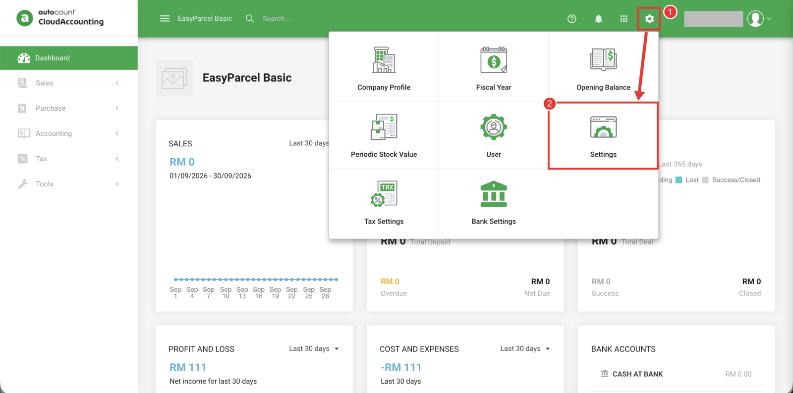

### Step 2: Create an API key

Click **API Keys → Create API Key**. Then click the **edit icon** on the new key to set what it may do.

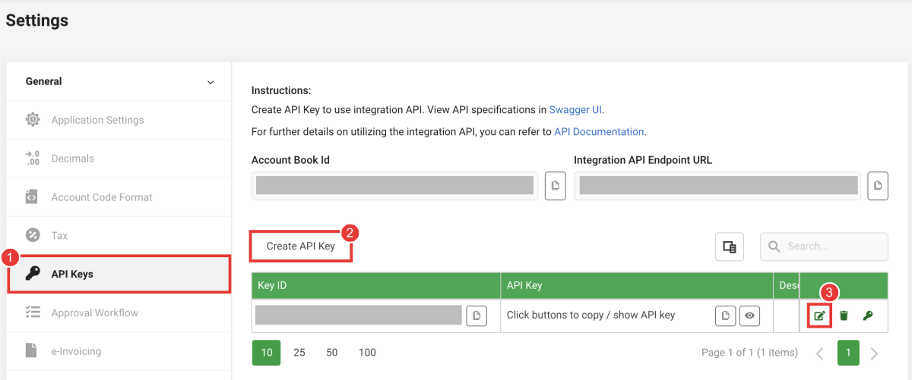

### Step 3: Give the key only the permissions EasyParcel needs

Untick **All Permissions**. Then expand each group under **Permissions** and tick exactly these, and click **Save**:

**Always needed**

| Group | Permissions |
|---|---|
| CompanyProfile | `GetRecord` |
| Account | `GetRecords` |
| Creditor | `GetRecords`, `GetRecord` |
| Location | `GetRecords` |
| PaymentMethod | `GetRecords` |
| PurchaseInvoice | `GetRecords`, `CreateRecord` |
| PurchaseReturn | `GetRecords`, `CreateRecord` |
| JournalEntry | `GetRecords`, `CreateRecord` |
| KnockOffEntry | `OutstandingTransactions`, `CreateRecord` |

**Also needed if you send your own sales to AutoCount**

| Group | Permissions |
|---|---|
| Debtor | `GetRecords`, `GetRecord`, `CreateRecord` |
| Invoice | `GetRecords`, `CreateRecord` |
| CreditNote | `GetRecords`, `CreateRecord` |

**Also needed if you take top-ups straight out of your bank account** (see Part 3, Step 2)

| Group | Permissions |
|---|---|
| Payment | `GetRecords`, `CreateRecord` |

> **Why not All Permissions?** EasyParcel never deletes, edits or voids anything in your book. Giving the key only what it needs keeps your book safe if the key is ever shared by mistake.

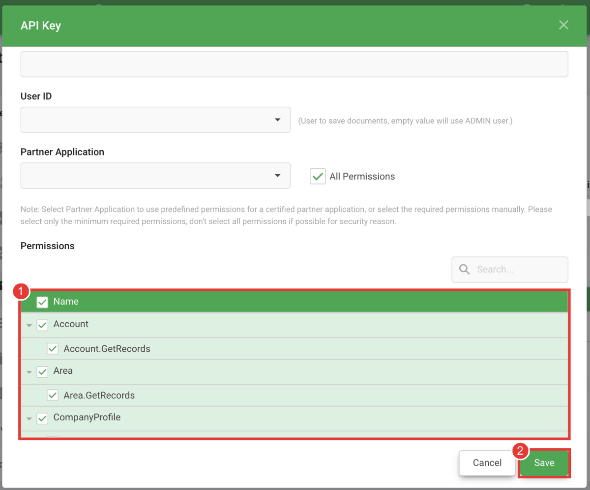

### Step 4: Copy the Key ID, API Key and Account Book Id

Back on the **API Keys** page, click the copy button beside each of these and keep them somewhere safe:

1. **Key ID**
2. **API Key** (click the eye icon to show it, or the copy button to copy it)
3. **Account Book Id**, at the top of the page

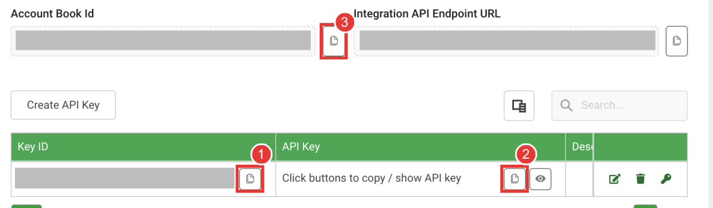

---

## Part 2 — Connect AutoCount Cloud to EasyParcel

### Step 1: Open the Accounting Tool

Log in to EasyParcel. Click the **app menu** (the grid icon at the top right) and choose **Accounting**.

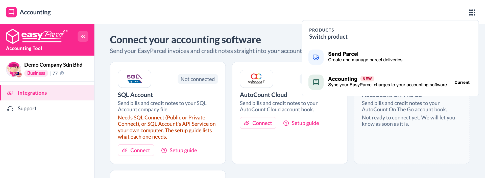

### Step 2: Click Connect on AutoCount Cloud

On the **Integrations** page, find the **AutoCount Cloud** card and click **Connect**.

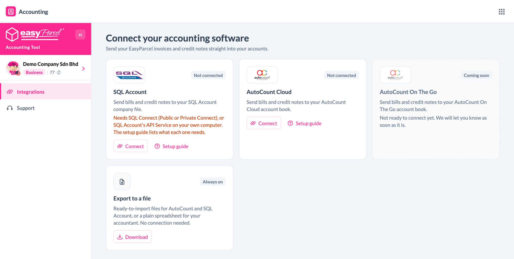

### Step 3: Enter your key

1. **Name this connection** — leave it as `AutoCount Cloud`, or give it a name you will recognise (useful if you keep more than one account book).
2. Paste your **Key ID**, **API key** and **Account book ID** from Part 1.
3. Click **Connect**.

The connection covers the wallet currency shown in the box: **MYR** for a Malaysia account, **SGD** for a Singapore account. Your account book must use the same currency.

> Not sure where the values are? Click **How do I get these keys?** in the box for the same steps as Part 1.

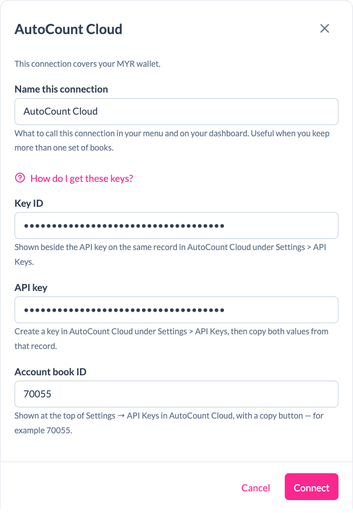

### Step 4: Check the company name, then continue

EasyParcel checks your key with AutoCount Cloud and shows which account book it connected to. Make sure it is the right company, then click **Continue setup**.

If it is the wrong company, click **Use different keys**.

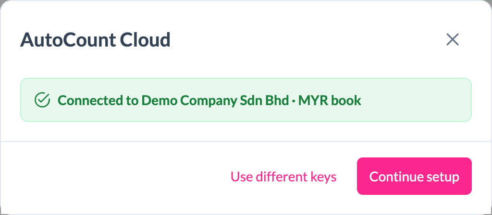

---

## Part 3 — Set up your connection

Setup has four short steps: **What to sync → Accounts → Tax → Schedule**. You can click **Save & finish later** at any time and come back from **Integrations → Finish setup**.

### Step 1: What to sync

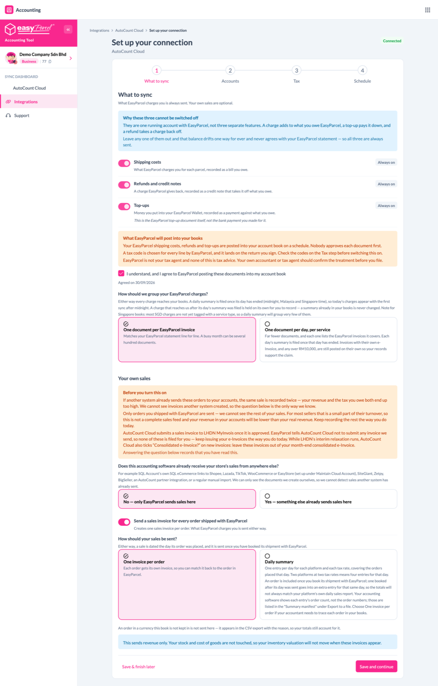

**Always sent** — these three are always on:

| Item | What it becomes in AutoCount Cloud |
|---|---|
| Shipping costs | A purchase invoice from EasyParcel |
| Refunds and credit notes | A purchase return that reduces what you owe EasyParcel |
| Top-ups | A payment to EasyParcel |

They can't be switched off. Together they keep your EasyParcel balance in AutoCount the same as your EasyParcel statement.

Then:

1. Tick **I understand, and I agree to EasyParcel posting these documents into my account book**. You can't switch the connection on without this.
2. **How should we group your EasyParcel charges?**
   - **One document per EasyParcel invoice** — matches your EasyParcel statement line by line. A busy month can mean several hundred documents.
   - **One document per day, per service** — far fewer documents. Each day's summary is sent after that day ends.

   > **Check your AutoCount plan.** AutoCount Cloud plans limit how many documents you can create. Once the limit is reached, AutoCount refuses new documents. If you ship a lot, choose **One document per day, per service**, or check your plan with AutoCount.
3. **Your own sales (optional).** EasyParcel can also send a sales invoice for every order you ship.
   - First answer **Does this accounting software already receive your store's sales from anywhere else?** If a marketplace link, an e-commerce plug-in or a manual import already puts your sales into AutoCount, choose **Yes**. Otherwise the same sales get recorded twice.
   - Then switch **Send a sales invoice for every order shipped with EasyParcel** on or off.
4. Click **Save and continue**.

### Step 2: Accounts

Tell EasyParcel which account in your AutoCount chart each type of entry goes to, and the settings AutoCount needs on every document.

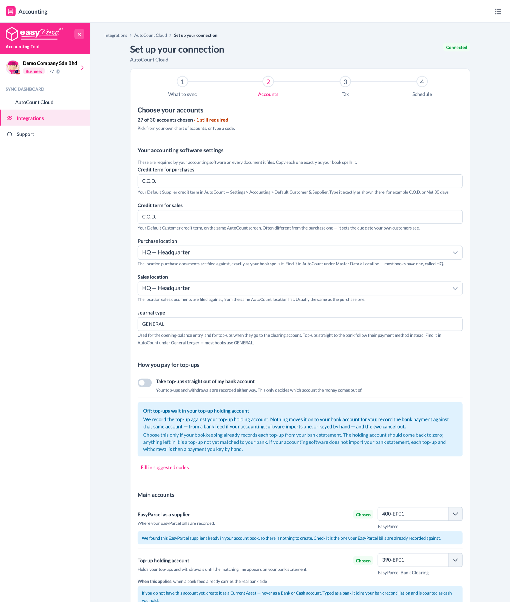

**Your accounting software settings** — AutoCount needs these on every document. Copy each one exactly as your book spells it:

| Setting | Where to find it in AutoCount Cloud |
|---|---|
| **Credit term for purchases** | Your Default Supplier credit term: **Settings → Accounting → Default Customer & Supplier**. Usually `C.O.D.` |
| **Credit term for sales** | Your Default Customer credit term, on the same screen |
| **Purchase location** / **Sales location** | Pick from the list. They come from **Master Data → Location**. Most books have one, called `HQ` |
| **Journal type** | Used for the opening balance, and for top-ups that go to the holding account. Most books use `GENERAL` |

**How you pay for top-ups**

- **Take top-ups straight out of my bank account** — leave this on if you pay top-ups from your bank account. Turn it off if you already record these payments from your bank statement, or you pay by card or an online payment gateway. Otherwise every top-up is counted twice.
- When it is **on**, also choose the **Payment method for top-ups**. Each option shows the bank account it posts to: pick the one for the bank account you top up from. If none points at it, create a payment method for that bank account in AutoCount first.

**Main accounts and the rest**

- Click **Fill in suggested codes** to fill every empty row with a suggested code, then check each one.
- Each row has a drop-down that lists your own AutoCount chart of accounts. You can also type a code.
- **EasyParcel as a supplier** must be a **creditor** in AutoCount, not a GL account. The drop-down lists your creditors for this row.
- **If an account does not exist yet**, create it in AutoCount first, then come back and pick it.
- Rows marked **When this applies** are only needed if you use that feature, for example Cash on Delivery or Instant Pay.

Click **Save and continue**.

### Step 3: Tax

This step is different for Malaysia and Singapore.

AutoCount Cloud can't tell EasyParcel which tax codes your book has. If a tax code does not exist in your book, you only find out when the first document using it is refused, so check the codes below exist before your first sync.

#### Malaysia (SST)

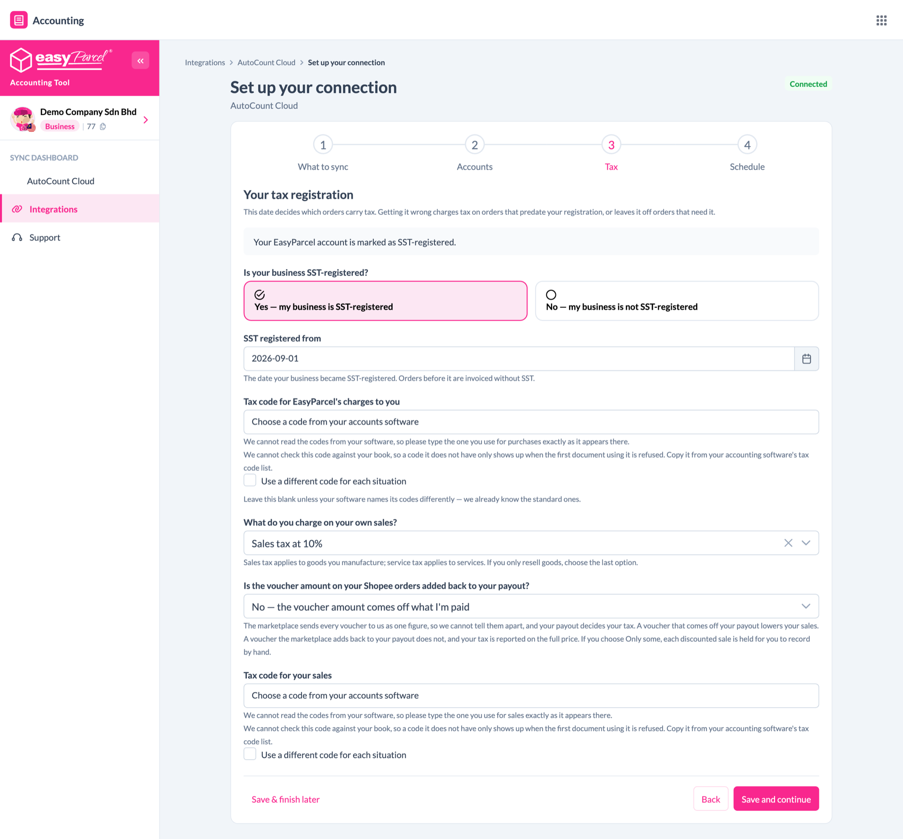

1. **Is your business SST-registered?** Choose **Yes** or **No**. If your EasyParcel account already has an SST number, Yes is selected for you.
2. If Yes, enter **SST registered from**: the date your business became SST-registered.
3. **Tax code for EasyParcel's charges to you** — leave this blank unless your AutoCount uses its own names for tax codes. EasyParcel uses AutoCount's standard SST codes (`PS-6`, `PS-8` for purchases, `SV-6`, `SV-8`, `S-5`, `S-10` for sales). AutoCount creates them when you run its **Malaysia SST** setup.

> SST you pay EasyParcel can't be claimed back, so it stays part of the delivery cost.

#### Singapore (GST)

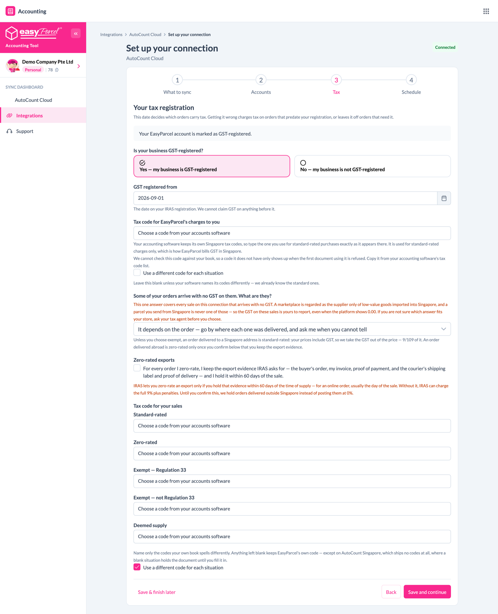

1. **Is your business GST-registered?** Choose **Yes** or **No**.
2. If Yes, enter **GST registered from**: the date on your IRAS registration. GST can't be claimed on anything before it.
3. **Tax code for EasyParcel's charges to you** — type the code your AutoCount uses for **standard-rated purchases**, exactly as it appears in your tax code list.

If you send your own sales to AutoCount, also answer:

4. **Some of your orders arrive with no GST on them. What are they?** Choose the answer that fits your store. If you are not sure, ask your tax agent before you choose.
5. **Zero-rated exports** — tick this only if you keep the export evidence IRAS asks for (the buyer's order, your invoice, proof of payment, the courier's shipping label and proof of delivery) within 60 days of the sale. Until you tick it, orders delivered outside Singapore are held instead of being sent at 0%.
6. **Tax code for your sales** — type your AutoCount code for each situation: **Standard-rated**, **Zero-rated**, **Exempt — Regulation 33**, **Exempt — not Regulation 33** and **Deemed supply**.

> **Fill in your tax codes for Singapore.** AutoCount Singapore doesn't come with standard tax codes, so EasyParcel can't guess them. A sale that needs a code you left blank is held until you fill it in.

> **Singapore prepaid credit.** In Singapore, EasyParcel charges GST when you **top up**, not on each shipment. To claim that GST, map a **Prepaid shipping credit** account in Step 2. Each top-up is then sent as a purchase invoice with the GST, and each shipment is paid out of that prepaid credit, so your EasyParcel bills show as paid in AutoCount.

Click **Save and continue**.

### Step 4: Schedule, then run your first sync

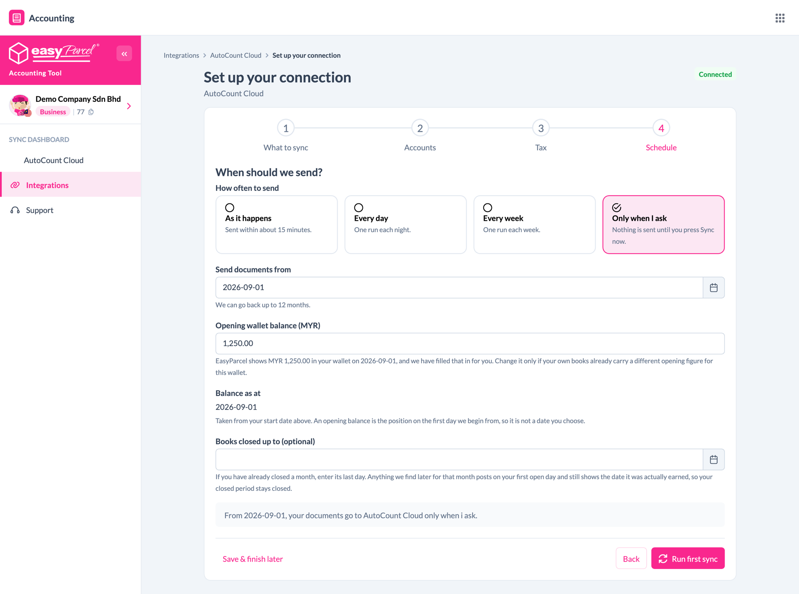

1. **How often to send**
   - **As it happens** — sent within about 15 minutes
   - **Every day** — one run each night
   - **Every week** — one run each week
   - **Only when I ask** — nothing is sent until you click **Sync now**
2. **Where should the first sync start?**
   - **The 1st of this month** (recommended)
   - **A date I choose**
   - **12 months ago**, the furthest back EasyParcel can go

   If you file SST or GST returns, start on the first day of the period you have **not** filed yet. If you already keyed in some EasyParcel bills by hand, start **after** the last one you recorded. Otherwise they are counted twice.

   The start date must fall inside a **financial year that is open in AutoCount**. AutoCount refuses documents dated outside it.
3. **Opening wallet balance** — if this box appears, enter how much was in your EasyParcel wallet on the start date.
4. **Books closed up to (optional)** — if you have already closed a month in AutoCount, enter its last day. Anything EasyParcel finds later for that month is posted on your first open day instead.
5. When you see **Everything is ready**, click **Run first sync**.

If anything is missing, a checklist appears above the button. It shows what to fix, with a link back to the right step.

> **A large first sync takes a while.** AutoCount Cloud accepts about 100 requests a minute, so a first sync going back several months may take some time. EasyParcel paces itself automatically. You don't need to do anything.

---

## Part 4 — Check your sync

### Sync Dashboard

Open **Sync Dashboard** from the left menu.

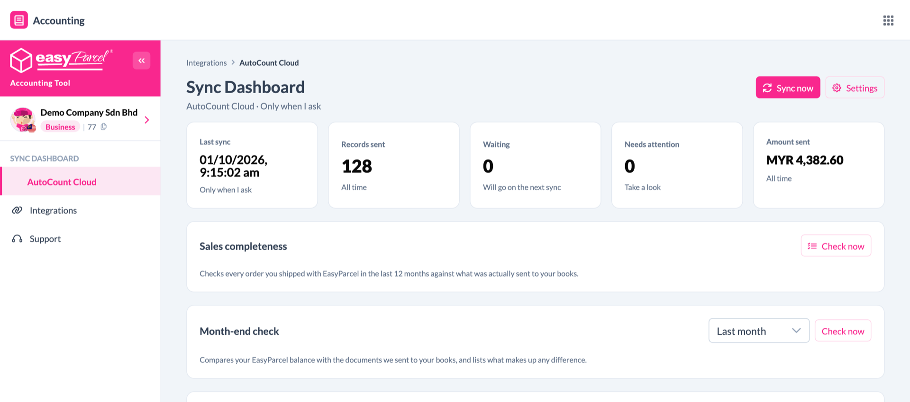

| Box | Meaning |
|---|---|
| **Last sync** | When EasyParcel last sent documents |
| **Records sent** | Documents now in AutoCount Cloud |
| **Waiting** | Documents that go on the next sync |
| **Needs attention** | Documents you need to look at |
| **Amount sent** | Total value sent so far |

- **Sync now** sends waiting documents straight away.
- **Settings** opens your setup again.
- **Month-end check** compares your EasyParcel balance with what was sent to AutoCount Cloud and lists anything that makes up a difference. Pick a month and click **Check now**.

### Synced records

Click any box on the dashboard (**Records sent**, **Waiting** or **Needs attention**) to open the full list.

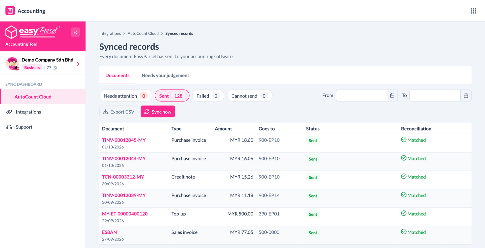

What each status means:

| Status | What it means | What to do |
|---|---|---|
| **Sent** | It is in AutoCount Cloud | Nothing |
| **Waiting for invoice number** | The EasyParcel invoice is not ready yet | Nothing. It is sent automatically when ready |
| **Waiting to send** / **Sending** | It is on its way | Nothing |
| **Failed** | AutoCount did not accept it. The reason is shown under the status | Fix the reason, then click **Try again** |
| **Needs checking** | It was sent, but AutoCount did not reply in time | Search AutoCount Cloud for the reference shown **before** doing anything. Do **not** key it in by hand. It may already be there |
| **Cannot send** | Something must change first. The reason is shown on the row | Follow the reason shown |
| **Journal needed** | EasyParcel never sends this one | Post the journal described in AutoCount Cloud, then mark it done |
| **Not sent by design** | It is deliberately not sent | Nothing |

The **Needs your judgement** tab is for your own sales, if you send them. An item appears here when an order's figures change after its invoice was sent, for example a partial refund. Check whether AutoCount needs a credit note, then answer **I corrected it** or **No change needed**.

**Export CSV** downloads the list as a spreadsheet.

---

## What gets sent to AutoCount Cloud

| From EasyParcel | Becomes in AutoCount Cloud |
|---|---|
| Shipping and other charges | Purchase Invoice (creditor: EasyParcel) |
| Refunds and credits from EasyParcel | Purchase Return |
| Wallet top-ups, and money paid into your wallet | Journal Entry, or a Cash Book payment if you take top-ups straight out of your bank account |
| Wallet withdrawals | Journal Entry, or a Cash Book receipt if you take top-ups straight out of your bank account |
| Opening wallet balance (once, on the start date) | Journal Entry |
| **Singapore with prepaid credit:** each charge and refund | Also a Journal Entry that pays it out of your prepaid credit, matched to the invoice so it shows **Full Payment** |
| **Optional:** your sales | Invoice (one customer per marketplace, created for you) |
| **Optional:** refunds on your sales | Credit Note |

Documents carry the EasyParcel reference, so you can search for them in AutoCount Cloud. A purchase invoice keeps the EasyParcel invoice number in **Supplier Invoice No.**

---

## Managing your connection

Go to **Integrations** to see your connection card.

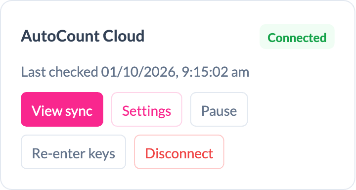

| Button | What it does |
|---|---|
| **View sync** | Opens the Sync Dashboard |
| **Settings** | Change any setup answer: what to sync, accounts, tax or schedule |
| **Pause** | Stops sending for now. Nothing is lost, and documents wait until you resume |
| **Re-enter keys** | Enter a new key, for example after you deleted the old one in AutoCount. It replaces the old key and does not create a second connection |
| **Disconnect** | Stops sending. Anything already sent stays in AutoCount Cloud |

---

## Malaysia and Singapore at a glance

| | Malaysia | Singapore |
|---|---|---|
| Currency | MYR | SGD |
| Tax | SST | GST |
| Tax step asks | SST-registered? Registered from date | GST-registered? Registered from date |
| Tax on EasyParcel charges | Charged on each shipment. Not claimable, so it stays part of the cost | Charged on each top-up. Claimed as input tax if you are GST-registered |
| Extra account to map | None | **Prepaid shipping credit**, to claim GST on top-ups |
| EasyParcel bills in AutoCount | Stay open (see FAQ) | Paid out of your prepaid credit and shown as **Full Payment** |
| Daily summary | Groups charges by service | Most SGD charges are not yet tagged with a service, so a daily summary groups very few of them |

Everything else is the same for both.

---

## Troubleshooting and FAQ

**Connect says my key is wrong.**
Check all three values: the **Key ID**, the **API key** and the **Account book ID**. A wrong account book is refused exactly like a wrong key. If all three are right, create a new API key under **Settings → API Keys** and enter it again.

**Documents show "Failed" and the reason mentions permission or 403.**
The key is missing one of the permissions in Part 1, Step 3. In AutoCount Cloud, open **Settings → API Keys**, click the edit icon on the key, tick the missing permissions and click **Save**. Then click **Try again** on the failed documents.

**AutoCount stopped accepting documents part-way through a sync.**
Your AutoCount plan has probably reached its document limit. Check your plan with AutoCount. Once you can add documents again, click **Try again** on the failed documents. Nothing was created for them, so nothing is sent twice.

**AutoCount says a location or credit term does not exist.**
Open **Settings → Accounts** in EasyParcel and check **Your accounting software settings**. Each value must match your book exactly, for example `C.O.D.` with the dots.

**AutoCount says the document date is not valid.**
The date falls outside a financial year that is open in AutoCount. Open that year in AutoCount, or move the start date in **Settings → Schedule**.

**AutoCount says an account or creditor does not exist.**
Create it in AutoCount Cloud, then pick it in **Settings → Accounts**.

**My EasyParcel purchase invoices all show as unpaid (Malaysia).**
That is expected. You already paid them from your EasyParcel wallet, and your top-ups are recorded against the EasyParcel creditor, so the balance you owe EasyParcel is correct. AutoCount just doesn't link each top-up to the bills it paid for. Look at the EasyParcel creditor's **balance**, not at each invoice's status.

**My sales invoices show as unpaid.**
That is expected. Your buyers paid the marketplace, not you, and the marketplace pays you later. Record each payout as a receipt against that marketplace's customer when it reaches your bank. EasyParcel doesn't know when, or how much after fees, the platform paid you.

**Will EasyParcel bills appear twice?**
Only if you also keyed them in by hand. Set the start date to the day after the last EasyParcel bill you recorded yourself.

**Will my sales appear twice?**
If something else already sends your sales to AutoCount (a marketplace link, an e-commerce plug-in or a manual import), keep **Send a sales invoice for every order** switched off.

**Can I change my answers later?**
Yes. Go to **Integrations → Settings** on your connection card.

**I already closed last month in AutoCount.**
Enter that month's last day in **Books closed up to** on the Schedule step. Late documents for a closed month are posted on your first open day and still show the date they belong to.

**Does disconnecting delete anything from AutoCount Cloud?**
No. Everything already sent stays in AutoCount Cloud. You can also delete the EasyParcel API key in AutoCount afterwards.

---

## Need help?

Click **Support** in the left menu of the Accounting Tool, or WhatsApp us at **+604-2023160**.
