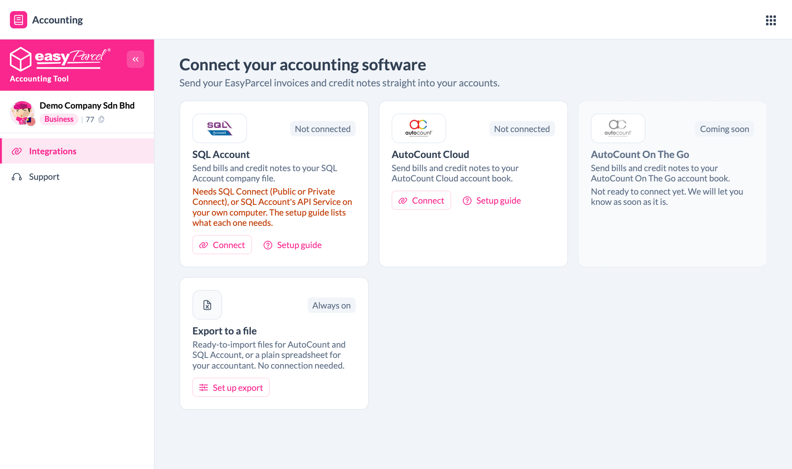
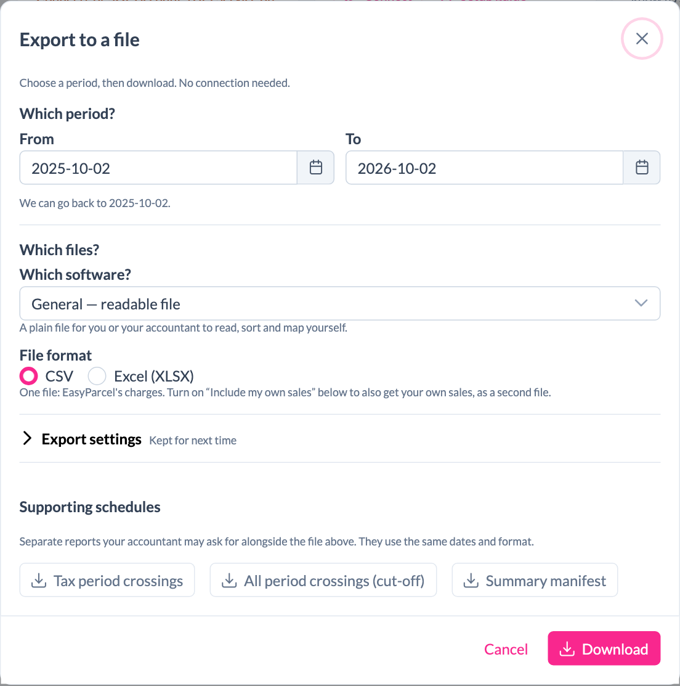
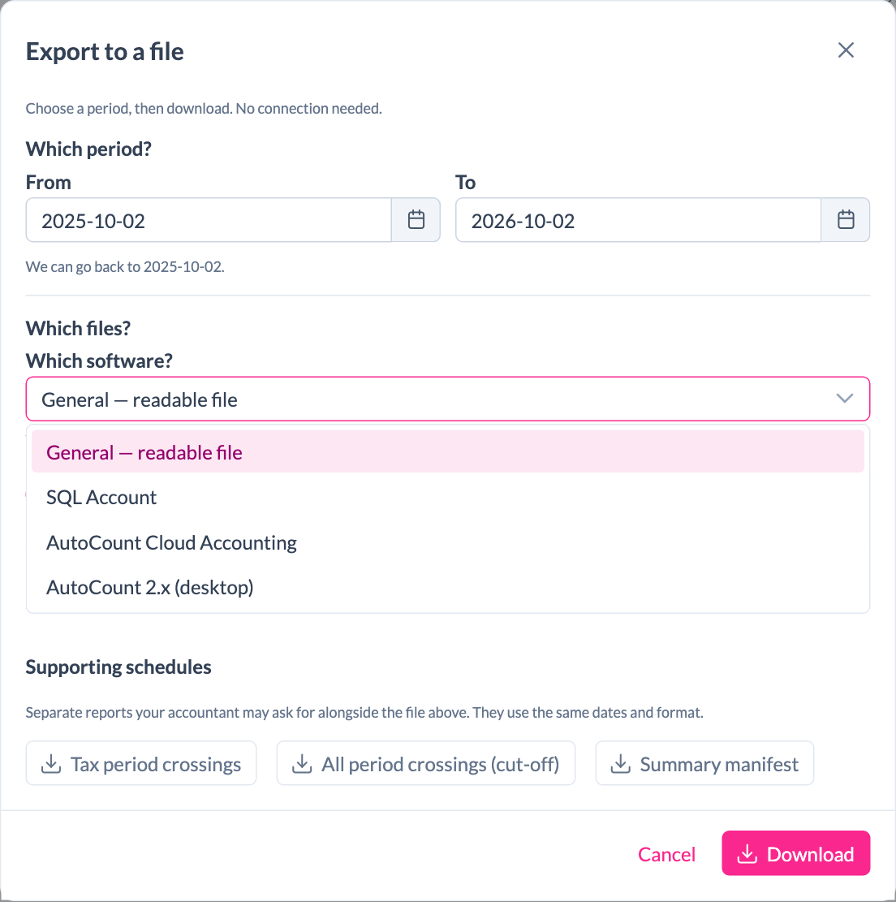
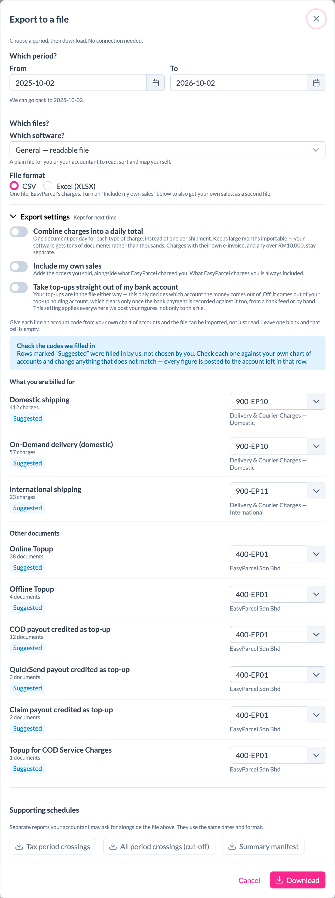
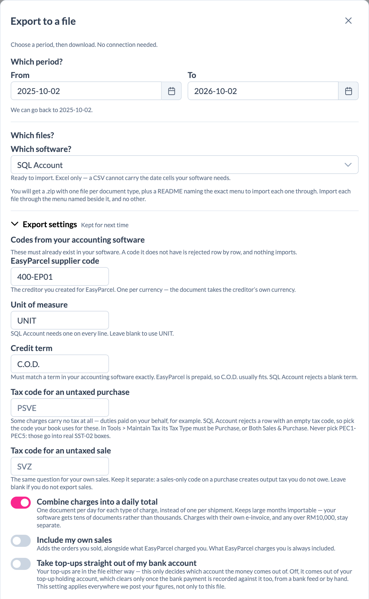
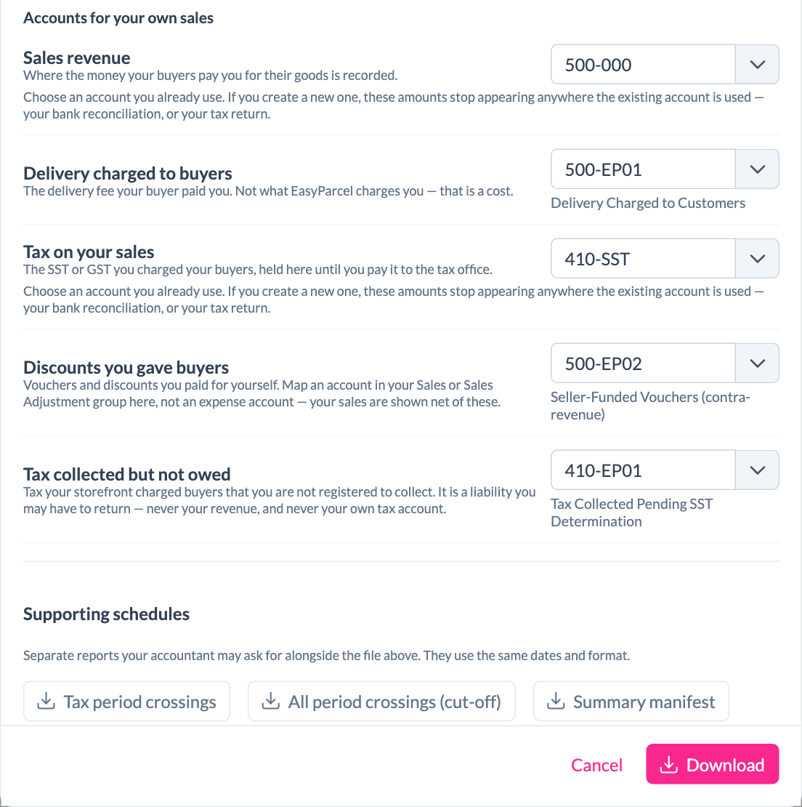

# EasyParcel Accounting Tool — Export to a File

Download your EasyParcel charges, refunds and top-ups as a file. Then import it into your accounting software, or hand it to your accountant. You don't need to connect anything first, and it works for both **Malaysia (MYR)** and **Singapore (SGD)** accounts. Where the two are different, this guide says so.

You can download:

- a **ready-to-import file** for **SQL Account**, **AutoCount Cloud Accounting** or **AutoCount 2.x (desktop)**, or
- a **plain spreadsheet** (CSV or Excel) for you or your accountant to read.

> All screenshots in this guide use demo data. Your own screens show your company name, account codes and amounts.

## Contents

1. [Open Export to a file](#step-1--open-export-to-a-file)
2. [Choose the period](#step-2--choose-the-period)
3. [Choose your software and file type](#step-3--choose-your-software-and-file-type)
4. [Fill in your export settings](#step-4--fill-in-your-export-settings)
5. [Download](#step-5--download)
6. [What is inside the download](#what-is-inside-the-download)
7. [Import the file into your software](#import-the-file-into-your-software)
8. [Supporting schedules for your accountant](#supporting-schedules-for-your-accountant)
9. [Malaysia and Singapore at a glance](#malaysia-and-singapore-at-a-glance)
10. [Troubleshooting and FAQ](#troubleshooting-and-faq)

---

## Step 1 — Open Export to a file

1. In EasyParcel, click the **app menu** (the grid icon at the top right) and choose **Accounting**.
2. On the **Integrations** page, find the **Export to a file** card. It is always on, so there is nothing to connect.
3. Click **Set up export**. After you've downloaded once, the button says **Download** instead.

The export window opens. The first time, it opens with **Export settings** expanded so you can fill them in. After that, the settings are folded away, so a normal download is just pick the dates, then click **Download**.

---

## Step 2 — Choose the period

Under **Which period?**, pick a **From** and a **To** date.

- You can go back **up to 12 months**. The window shows the earliest date you can choose.
- One file covers **one currency**. If you have both a MYR and an SGD wallet, a **Currency** box appears. Choose one, then download again for the other.

> **Tip:** export one month at a time, for example the 1st to the last day of the month. This makes it easy to match the file against your EasyParcel statement.

---

## Step 3 — Choose your software and file type

Under **Which software?**, pick where the file will go.

| Choose | You get | Use it when |
|---|---|---|
| **General — readable file** | A plain **CSV** or **Excel (XLSX)** file | You or your accountant want to read, sort or key in the figures yourselves |
| **SQL Account** | Ready-to-import Excel files | You use SQL Account and want to import instead of keying in |
| **AutoCount Cloud Accounting** | Ready-to-import Excel files | You use AutoCount Cloud |
| **AutoCount 2.x (desktop)** | Ready-to-import Excel files | You use the desktop version of AutoCount |

- For **General**, choose **CSV** or **Excel (XLSX)** under **File format**.
- For **SQL Account** and **AutoCount**, the file is always Excel, because your software needs real date cells and a CSV can't carry them.

> **Already connected to SQL Account?** You don't need this export for your EasyParcel charges, because your connection sends them for you. Use the export only for a period you want to import yourself, or as a copy for your accountant.

---

## Step 4 — Fill in your export settings

Click **Export settings** to open them. Whatever you fill in here is **kept for next time**, so you only do this once.

### Codes from your accounting software (SQL Account and AutoCount only)

When you pick SQL Account or AutoCount, this box appears first. Each code must **already exist** in your accounting software, spelt exactly the same. If your software doesn't have a code, it rejects the rows that use it and nothing imports.

| Field | What to enter |
|---|---|
| **EasyParcel supplier code** | The supplier (creditor) you created for EasyParcel, for example `400-EP01`. Create **one per currency**: the document takes the supplier's own currency. |
| **Unit of measure** *(SQL Account)* | Leave blank to use `UNIT`. |
| **Credit term** | Must match a term in your software exactly. EasyParcel is prepaid, so `C.O.D.` usually fits. SQL Account won't accept a blank term. |
| **Location** *(AutoCount)* | Your purchase and sales location. Use `HQ` if you only have one. |
| **Tax code for an untaxed purchase** | The code your book uses for charges that carry no tax, such as duties paid on your behalf. SQL Account rejects a row with no tax code. Malaysia: never pick **PEC1–PEC5**, because those go into real SST-02 boxes. |
| **Tax code for an untaxed sale** | The same, but for your own sales. Leave it blank if you don't export sales. |

### Three switches

| Switch | What it does |
|---|---|
| **Combine charges into a daily total** | Gives one document per day for each type of charge, instead of one per shipment. Your software then imports tens of documents rather than thousands. Charges that have their own e-invoice, and any charge over RM10,000, stay separate. |
| **Include my own sales** | Adds the orders you sold, alongside what EasyParcel charged you. EasyParcel's charges are always included. |
| **Take top-ups straight out of my bank account** | Your top-ups are in the file either way. This switch only decides which account the money comes out of: your **bank account** (on) or your **top-up holding account** (off). If you're also connected to SQL Account, this setting applies there too. |

### Account codes

Give each line an account code from **your own chart of accounts**. Lines marked **Suggested** were filled in by EasyParcel, not chosen by you, so check each one and change anything that doesn't match your book. If you leave a line blank, that cell in the file is empty.

- **What you are billed for:** your shipping charges, such as domestic, international and on-demand delivery.
- **Other documents:** top-ups, and COD, QuickSend and claim payouts credited as top-up.
- **Accounts for your own sales:** appears only when **Include my own sales** is on.

> **Tip:** choose accounts you already use, especially for **Sales revenue** and **Tax on your sales**. If you create new ones, these amounts won't appear where your bank reconciliation or tax return looks for them.

---

## Step 5 — Download

Click **Download**. Your settings are saved and the file goes to your computer's **Downloads** folder.

---

## What is inside the download

### General — readable file

| Include my own sales | You get |
|---|---|
| Off | **One file** with EasyParcel's charges |
| On | **A .zip with two files**: one for EasyParcel's charges, one for your own sales |

Each row shows the document number, type, date, currency, description, amount, tax code and rate, tax charged, account code and shipment number. The **Amount** column totals to what EasyParcel charged you, so you can check it against your EasyParcel statement.

### SQL Account or AutoCount

You always get a **.zip** containing:

| File | What it is |
|---|---|
| **READ-ME-FIRST.txt** | Open this first. It names the exact import menu for each file, lists the codes your book must already have, and shows a wallet check (opening + money in − money out = closing). |
| **One Excel file per document type** | For example, purchase invoices, purchase returns (refunds), and your sales invoices and credit notes if sales are included. A large period may be split into parts, such as `part1of2`. |
| **…-post-manually.xlsx** *(only when needed)* | Entries that can't be imported and need a person, each with **What to post** beside it. |

The **post-manually** file can have these tabs:

| Tab | What to do |
|---|---|
| **Wallet movements** | Money moving between your bank and your EasyParcel wallet. Key these in as shown. |
| **Opening balance** | The wallet balance you already had when you started. Key it in once. |
| **Do not post yet** | **Don't key these in.** They're listed only so your wallet balance adds up. |
| **Needs a decision** | Charges EasyParcel has no rule for yet. Decide with your accountant where they go. |
| **Choose the tax code** | Tax to claim back or tax you owe, but EasyParcel couldn't tell which code your book uses. Pick the code and key it in. |
| **Key in by hand** | Your software supports these, but there's no import file for them. Key them in on the screen named beside each one. |
| **E-invoice check** *(Malaysia)* | Costs over RM10,000 that may need their own e-invoice to support your tax deduction. These are **also** in the import files, so this tab is only a check. |

---

## Import the file into your software

> **Important:** your software decides the document type from the **menu you import through**, not from the file. Always import each file through the menu named for it in **READ-ME-FIRST.txt**, and no other.

### SQL Account

1. Open the Excel file and press **Ctrl+A**, then **Ctrl+C**.
2. In SQL Account, go to the menu for that file:
   - Purchase invoices: **File → Import → Purchase Invoice**
   - Purchase returns (refunds): **File → Import → Purchase Returned**
   - Sales invoices: **File → Import → Sales Invoice**
   - Sales credit notes: **File → Import → Credit Note**
3. Choose **Paste from Clipboard**, then **Validate**, then **Import**.

Before your first import, check that SQL Account has the EasyParcel supplier, one customer code per marketplace (if you export sales; the codes are listed in READ-ME-FIRST.txt), the account codes, the unit of measure, the credit term and the tax codes. You need SQL Account version **5.2025.1051.887 or newer**. Older versions have no purchase table to paste into.

### AutoCount Cloud Accounting

1. Open the listing for that file:
   - **Purchase Invoice**, **Purchase Return**, **Invoice** or **Credit Note** listing
2. Choose **Import Data → Select File**, and pick the Excel file **as it is**. Don't copy it or save it again.
3. Check **Preview Data** (the number of documents should match), then click **Import**.

After importing a **Purchase Return**, knock it off against the invoice yourself (**Accounting Menu → Knock Off Entry**). AutoCount Cloud imports it unapplied.

### AutoCount 2.x (desktop)

1. Open the Excel file and press **Ctrl+A**, then **Ctrl+C**.
2. In AutoCount, go to **File → Import From Excel** and choose **Import A/P Invoice**, **Import A/P Credit Note**, **Import A/R Invoice** or **Import A/R Credit Note**, then paste.

If you import refunds, first create a C/N Type called **RETURN** (**General Maintenance → C/N Type Maintenance**).

> **Import each period only once.** Importing the same month twice creates every document twice.

---

## Supporting schedules for your accountant

At the bottom of the export window, under **Supporting schedules**, are three extra reports your accountant may ask for. They use the same dates and file format you chose above.

| Report | What it shows |
|---|---|
| **Tax period crossings** | Taxed documents recorded in a different month from the one they were earned in. Useful when preparing an SST or GST return. |
| **All period crossings (cut-off)** | The same, but for every document, taxed or not. Useful at month-end or year-end cut-off. |
| **Summary manifest** | When **Combine charges into a daily total** is on, this lists every EasyParcel invoice (and order) behind each daily total. |

---

## Malaysia and Singapore at a glance

| | Malaysia | Singapore |
|---|---|---|
| Currency | MYR | SGD |
| Tax | SST | GST |
| Untaxed tax codes | Never pick PEC1–PEC5 | Use your book's own no-tax / out-of-scope code |
| E-invoice check tab | Yes, for costs over RM10,000 | No |
| Supplier code | One EasyParcel supplier per currency | One EasyParcel supplier per currency |

If you have wallets in **both** currencies, download one file for each currency.

---

## Troubleshooting and FAQ

**The window says it couldn't find an EasyParcel wallet.**
Your account has no EasyParcel wallet in a currency the export supports yet, so there are no figures to put in the file. If you think this is wrong, contact us (see below).

**My software rejects rows with "Code not found".**
That code doesn't exist in your book yet. Create it (supplier, customer, account, unit, term or tax code), spelt exactly as in the file, then import again. READ-ME-FIRST.txt lists every code the file uses.

**SQL Account rejects every row.**
Check the **Credit term** and both **untaxed tax codes** in Export settings. SQL Account won't accept blanks for these.

**The import has thousands of documents.**
Switch on **Combine charges into a daily total** and download again.

**I picked a date earlier than 12 months ago.**
The export only goes back 12 months. The earliest date you can pick is shown under the dates.

**Do I need to connect SQL Account or AutoCount to use this?**
No. The export works without any connection.

**Are my settings saved?**
Yes. Everything under **Export settings** is kept for next time. The period is not saved, so you choose it every time you download.

---

## Need help?

Click **Support** in the left menu of the Accounting Tool, or WhatsApp us at **+604-2023160**.
