# EasyParcel Accounting Tool — SQL Account Guide

Send your EasyParcel charges, refunds and top-ups straight into SQL Account, so you no longer key them in by hand. This guide works for both **Malaysia (MYR)** and **Singapore (SGD)** accounts. Where the two are different, it says so.

> All screenshots in this guide use demo data. Your own screens show your company name, account codes and amounts.

## Contents

1. [Get your API keys from SQL Account](#part-1--get-your-api-keys-from-sql-account)
2. [Connect SQL Account to EasyParcel](#part-2--connect-sql-account-to-easyparcel)
3. [Set up your connection](#part-3--set-up-your-connection)
4. [Check your sync](#part-4--check-your-sync)
5. [What gets sent to SQL Account](#what-gets-sent-to-sql-account)
6. [Managing your connection](#managing-your-connection)
7. [Malaysia and Singapore at a glance](#malaysia-and-singapore-at-a-glance)
8. [Troubleshooting and FAQ](#troubleshooting-and-faq)

---

## Part 1 — Get your API keys from SQL Account

EasyParcel talks to SQL Account through SQL Account's own API, using two keys: an **Access Key** and a **Secret Key**. You create them once, inside SQL Account.

> **Note:** your SQL Account needs **SQL Connect** (Public or Private Connect) or SQL Account's **API Service** for this to work. If you are not sure whether you have it, ask your SQL Account dealer.

### Step 1: Open Maintain User

In SQL Account, go to **Tools → Maintain User…**

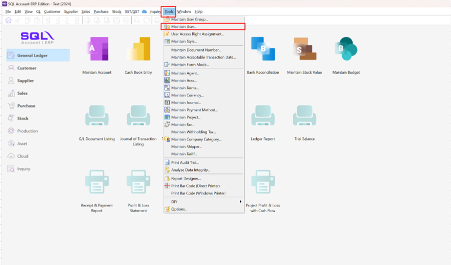

### Step 2: Create a user just for EasyParcel

Click **New** and create a user for EasyParcel only (for example, code `EASYPARCEL`).

> **Why a separate user?** Generating API keys switches off that user's normal login. Don't use your own login or one your staff use.

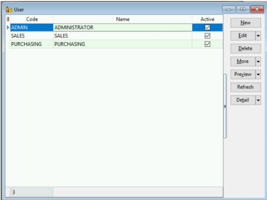

### Step 3: Open API Secret Key

With the new user open, click **More → API Secret Key**.

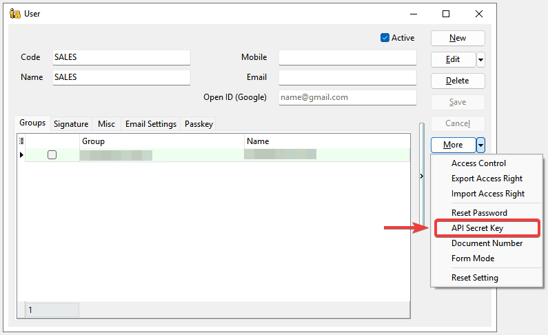

### Step 4: Generate the key

Click **Generate API Secret Key**.

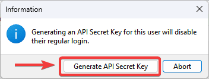

### Step 5: Copy both keys

Copy the **Access Key** and the **Secret Key**, and keep them somewhere safe.

- Copy the Access Key **in full**, including the part before `.sql.my`.
- The Secret Key is shown **only once**. If you lose it, click **Revoke** and generate a new pair.

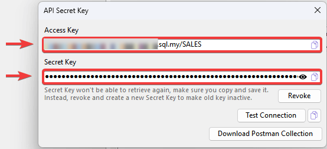

### Step 6: Test the connection

Click **Test Connection**. When it shows **OK**, the keys are ready to use.

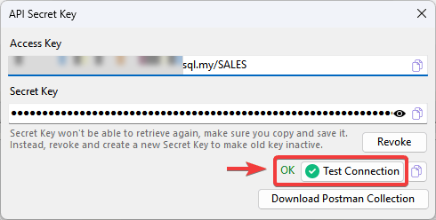

---

## Part 2 — Connect SQL Account to EasyParcel

### Step 1: Open the Accounting Tool

Log in to EasyParcel. Click the **app menu** (the grid icon at the top right) and choose **Accounting**.

### Step 2: Click Connect on SQL Account

On the **Integrations** page, find the **SQL Account** card and click **Connect**.

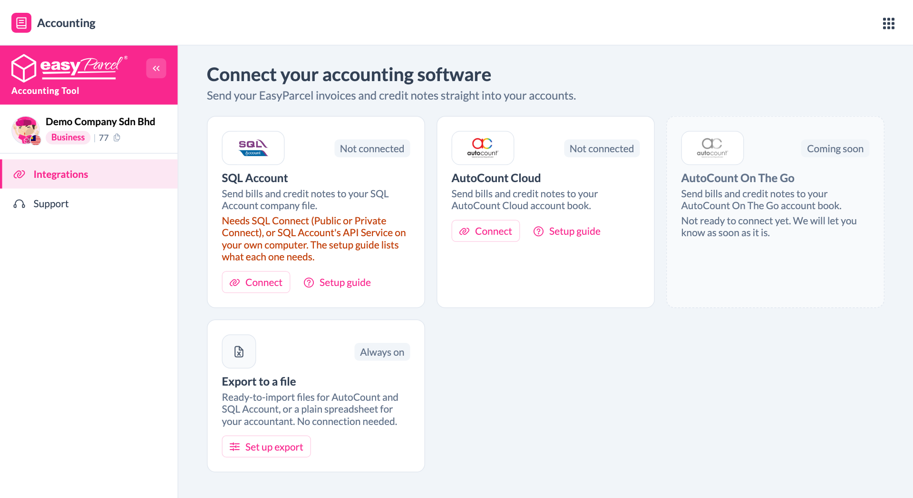

### Step 3: Enter your keys

1. **Name this connection** — leave it as `SQL Account`, or give it a name you will recognise (useful if you keep more than one set of books).
2. Paste your **Access Key** and **Secret Key** from Part 1.
3. Click **Connect**.

The connection covers the wallet currency shown in the box: **MYR** for a Malaysia account, **SGD** for a Singapore account.

> Not sure where the keys are? Click **How do I get these keys?** in the box for the same steps as Part 1.

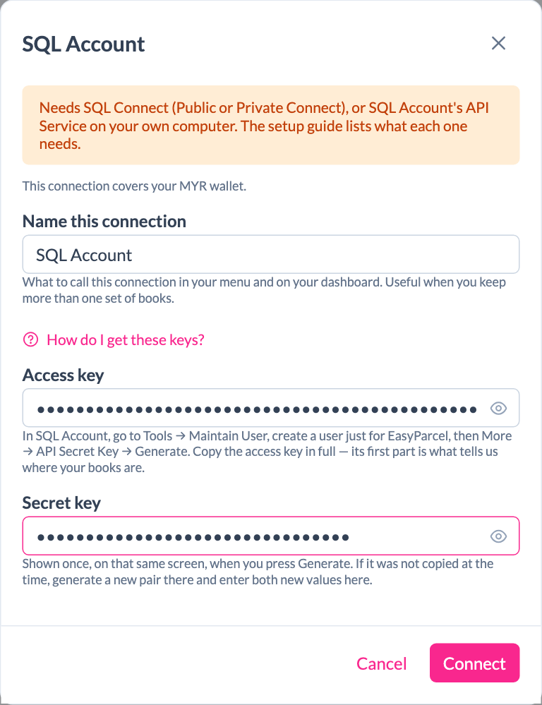

### Step 4: Check the company name, then continue

EasyParcel checks your keys with SQL Account and shows which company book it connected to. Make sure it is the right company, then click **Continue setup**.

If it is the wrong company, click **Use different keys**.

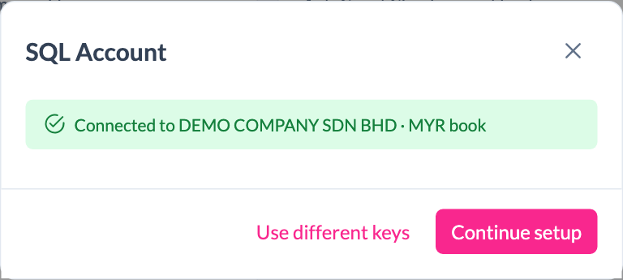

---

## Part 3 — Set up your connection

Setup has four short steps: **What to sync → Accounts → Tax → Schedule**. You can click **Save & finish later** at any time and come back from **Integrations → Finish setup**.

### Step 1: What to sync

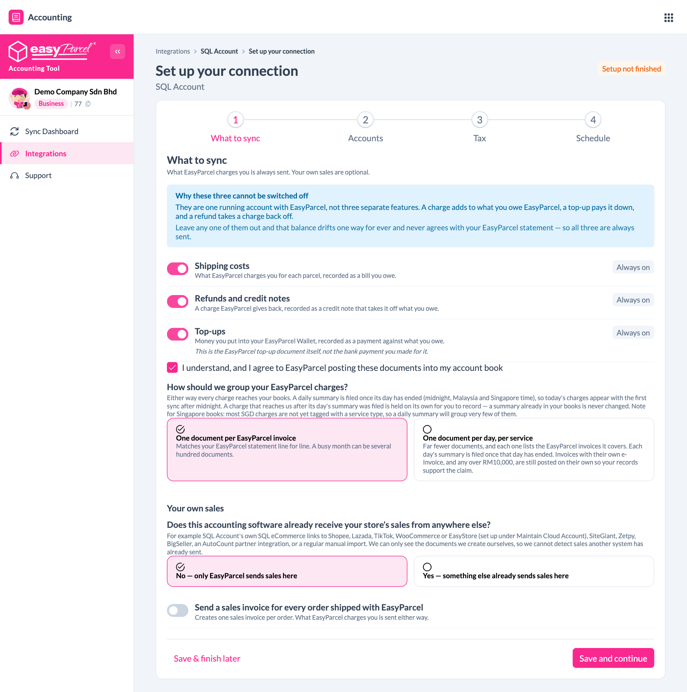

**Always sent** — these three are always on:

| Item | What it becomes in SQL Account |
|---|---|
| Shipping costs | A bill from EasyParcel |
| Refunds and credit notes | A credit note that reduces what you owe EasyParcel |
| Top-ups | A payment to EasyParcel |

They can't be switched off. Together they keep your EasyParcel balance in SQL Account the same as your EasyParcel statement.

Then:

1. Tick **I understand, and I agree to EasyParcel posting these documents into my account book**. You can't switch the connection on without this.
2. **How should we group your EasyParcel charges?**
   - **One document per EasyParcel invoice** — matches your EasyParcel statement line by line. A busy month can mean several hundred documents.
   - **One document per day, per service** — far fewer documents. Each day's summary is sent after that day ends.
3. **Your own sales (optional).** EasyParcel can also send a sales invoice for every order you ship.
   - First answer **Does this accounting software already receive your store's sales from anywhere else?** If SQL eCommerce, SiteGiant, a marketplace link or a manual import already puts your sales into SQL Account, choose **Yes**. Otherwise the same sales get recorded twice.
   - Then switch **Send a sales invoice for every order shipped with EasyParcel** on or off.
4. Click **Save and continue**.

### Step 2: Accounts

Tell EasyParcel which account in your SQL Account chart each type of entry goes to.

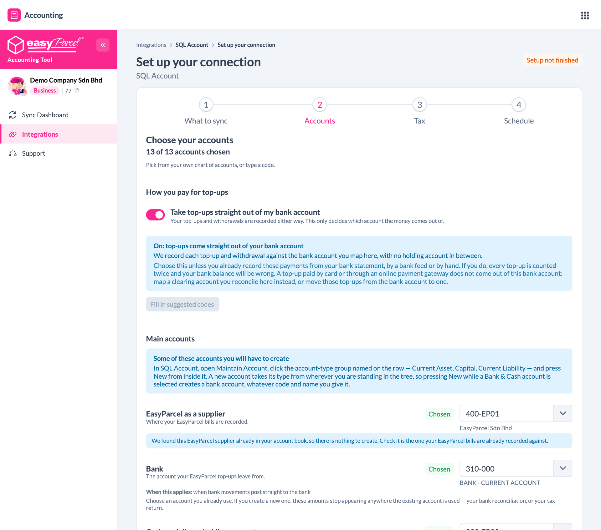

- Click **Fill in suggested codes** to fill every empty row with a suggested code, then check each one.
- Each row has a drop-down that lists your own SQL Account chart of accounts. You can also type a code.
- **Take top-ups straight out of my bank account** — leave this on if you pay top-ups from your bank account. Turn it off if you already record these payments from your bank statement, or you pay by card or an online payment gateway. Otherwise every top-up is counted twice.
- **If an account does not exist yet**, create it in SQL Account first: open **Maintain Account**, click the account group named on the row (for example *Current Asset* or *Capital*), then click **New**. Then come back and pick it.
- Rows marked **When this applies** are only needed if you use that feature, for example Cash on Delivery or Instant Pay.

Click **Save and continue**.

### Step 3: Tax

This step is different for Malaysia and Singapore.

#### Malaysia (SST)

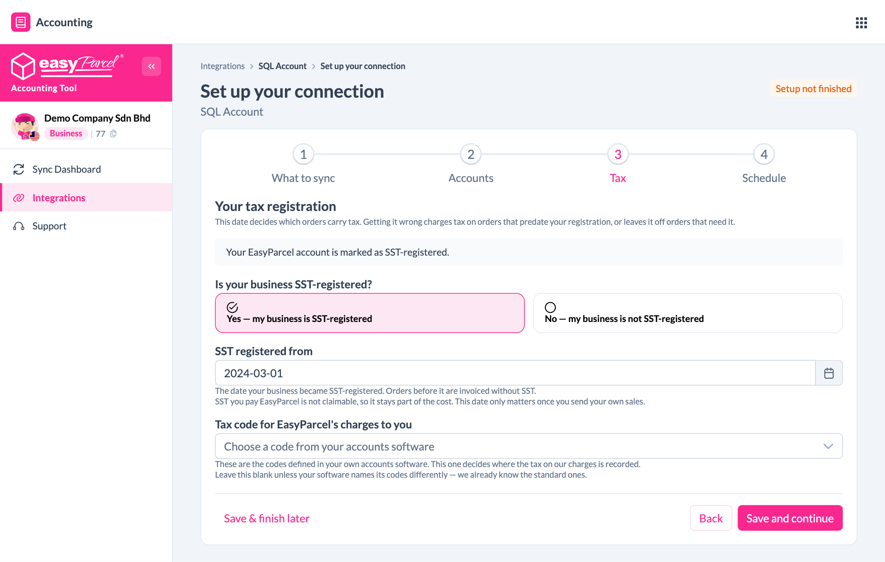

1. **Is your business SST-registered?** Choose **Yes** or **No**. If your EasyParcel account already has an SST number, Yes is selected for you.
2. If Yes, enter **SST registered from**: the date your business became SST-registered.
3. **Tax code for EasyParcel's charges to you** — leave this blank unless your SQL Account uses its own names for tax codes. EasyParcel already knows the standard ones.

> SST you pay EasyParcel can't be claimed back, so it stays part of the delivery cost.

#### Singapore (GST)

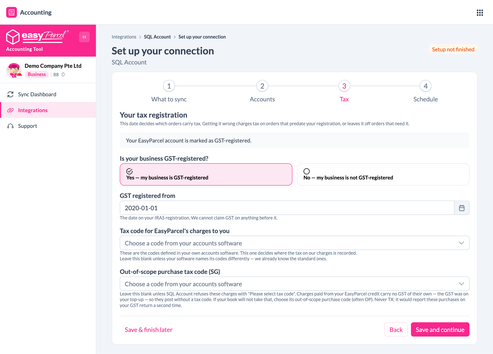

1. **Is your business GST-registered?** Choose **Yes** or **No**.
2. If Yes, enter **GST registered from**: the date on your IRAS registration.
3. **Tax code for EasyParcel's charges to you** — leave this blank unless your SQL Account uses its own names for tax codes.
4. **Out-of-scope purchase tax code (SG)** — leave this blank. Only fill it in if SQL Account rejects documents with *"Please select tax code"*. Then choose your out-of-scope purchase code (often `OP`). **Never choose `TX`.** It would report these purchases on your GST return twice.

Click **Save and continue**.

### Step 4: Schedule, then run your first sync

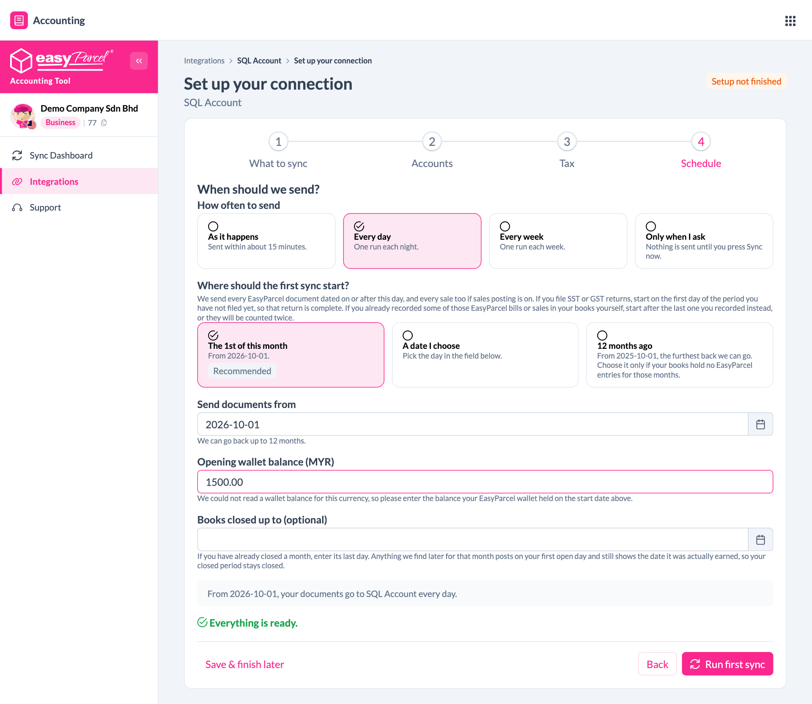

1. **How often to send**
   - **As it happens** — sent within about 15 minutes
   - **Every day** — one run each night
   - **Every week** — one run each week
   - **Only when I ask** — nothing is sent until you click **Sync now**
2. **Where should the first sync start?**
   - **The 1st of this month** (recommended)
   - **A date I choose**
   - **12 months ago**, the furthest back EasyParcel can go

   If you file SST or GST returns, start on the first day of the period you have **not** filed yet. If you already keyed in some EasyParcel bills by hand, start **after** the last one you recorded. Otherwise they are counted twice.
3. **Opening wallet balance** — if this box appears, enter how much was in your EasyParcel wallet on the start date.
4. **Books closed up to (optional)** — if you have already closed a month in SQL Account, enter its last day. Anything EasyParcel finds later for that month is posted on your first open day instead.
5. When you see **Everything is ready**, click **Run first sync**.

If anything is missing, a checklist appears above the button. It shows what to fix, with a link back to the right step.

---

## Part 4 — Check your sync

### Sync Dashboard

Open **Sync Dashboard** from the left menu.

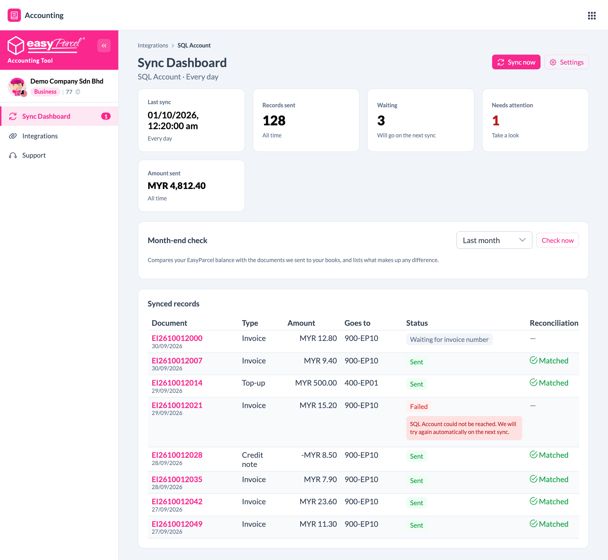

| Box | Meaning |
|---|---|
| **Last sync** | When EasyParcel last sent documents |
| **Records sent** | Documents now in SQL Account |
| **Waiting** | Documents that go on the next sync |
| **Needs attention** | Documents you need to look at |
| **Amount sent** | Total value sent so far |

- **Sync now** sends waiting documents straight away.
- **Settings** opens your setup again.
- **Month-end check** compares your EasyParcel balance with what was sent to SQL Account and lists anything that makes up a difference. Pick a month and click **Check now**.

### Synced records

Click any box on the dashboard (**Records sent**, **Waiting** or **Needs attention**) to open the full list.

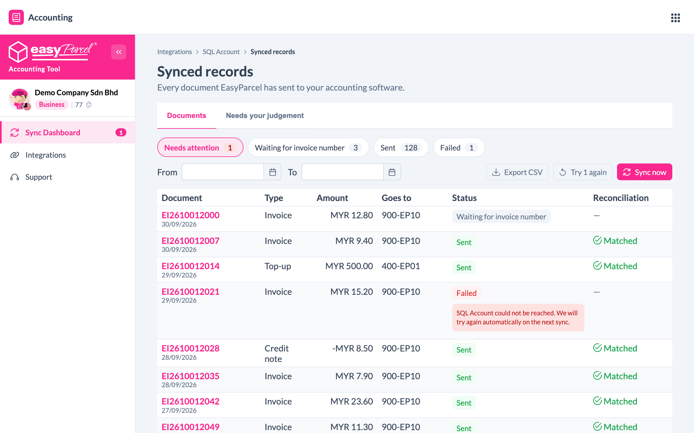

What each status means:

| Status | What it means | What to do |
|---|---|---|
| **Sent** | It is in SQL Account | Nothing |
| **Waiting for invoice number** | The EasyParcel invoice is not ready yet | Nothing. It is sent automatically when ready |
| **Waiting to send** / **Sending** | It is on its way | Nothing |
| **Failed** | SQL Account did not accept it. The reason is shown under the status | Fix the reason, then click **Try again** |
| **Needs checking** | It was sent, but SQL Account did not reply in time | Search SQL Account for the reference shown **before** doing anything. Do **not** key it in by hand. It may already be there |
| **Cannot send** | Something must change first. The reason is shown on the row | Follow the reason shown |
| **Journal needed** | EasyParcel never sends this one | Post the journal described in SQL Account, then mark it done |
| **Not sent by design** | It is deliberately not sent | Nothing |

The **Needs your judgement** tab is for your own sales, if you send them. An item appears here when an order's figures change after its invoice was sent, for example a partial refund. Check whether SQL Account needs a credit note, then answer **I corrected it** or **No change needed**.

**Export CSV** downloads the list as a spreadsheet.

---

## What gets sent to SQL Account

| From EasyParcel | Becomes in SQL Account |
|---|---|
| Shipping and other charges | Purchase Invoice (supplier: EasyParcel) |
| Refunds and credits from EasyParcel | Supplier Credit Note |
| Wallet top-ups, and money paid into your wallet | Supplier Payment |
| Wallet withdrawals | Supplier Refund |
| Opening wallet balance (once, on the start date) | Journal Entry |
| **Optional:** your sales | Customer Invoice |
| **Optional:** refunds on your sales | Customer Credit Note |

Documents carry the EasyParcel reference, so you can search for them in SQL Account.

---

## Managing your connection

Go to **Integrations** to see your connection card.

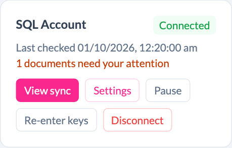

| Button | What it does |
|---|---|
| **View sync** | Opens the Sync Dashboard |
| **Settings** | Change any setup answer: what to sync, accounts, tax or schedule |
| **Pause** | Stops sending for now. Nothing is lost, and documents wait until you resume |
| **Re-enter keys** | Enter new keys, for example after you revoked them in SQL Account. It replaces the old keys and does not create a second connection |
| **Disconnect** | Stops sending. Anything already sent stays in SQL Account |

---

## Malaysia and Singapore at a glance

| | Malaysia | Singapore |
|---|---|---|
| Currency | MYR | SGD |
| Tax | SST | GST |
| Tax step asks | SST-registered? Registered from date | GST-registered? Registered from date, and an optional out-of-scope purchase code |
| Tax on EasyParcel charges | Not claimable, so it stays part of the cost | Claimed as input tax if you are GST-registered |
| Daily summary | Groups charges by service | Most SGD charges are not yet tagged with a service, so a daily summary groups very few of them |

Everything else is the same for both.

---

## Troubleshooting and FAQ

**Connect says my keys are wrong.**
Copy the Access Key **in full**, including the part before `.sql.my`. If you no longer have the Secret Key, go back to SQL Account, click **Revoke**, generate a new pair and enter both new keys.

**It connected to the wrong company.**
Click **Use different keys**. Generate keys for a user in the right company's book in SQL Account.

**Documents show "Failed — SQL Account could not be reached".**
Your SQL Connect or SQL Account API Service was offline. Make sure it is running. EasyParcel tries again automatically on the next sync, or you can click **Try again**.

**SQL Account says an account code does not exist.**
Create the account in SQL Account (**Maintain Account → choose the group → New**), then pick it in **Settings → Accounts**.

**Will EasyParcel bills appear twice?**
Only if you also keyed them in by hand. Set the start date to the day after the last EasyParcel bill you recorded yourself.

**Will my sales appear twice?**
If something else already sends your sales to SQL Account (SQL eCommerce, SiteGiant, a marketplace link or a manual import), keep **Send a sales invoice for every order** switched off.

**Can I change my answers later?**
Yes. Go to **Integrations → Settings** on your connection card.

**I already closed last month in SQL Account.**
Enter that month's last day in **Books closed up to** on the Schedule step. Late documents for a closed month are posted on your first open day and still show the date they belong to.

**Does disconnecting delete anything from SQL Account?**
No. Everything already sent stays in SQL Account.

---

## Need help?

Click **Support** in the left menu of the Accounting Tool, or WhatsApp us at **+604-2023160**.
