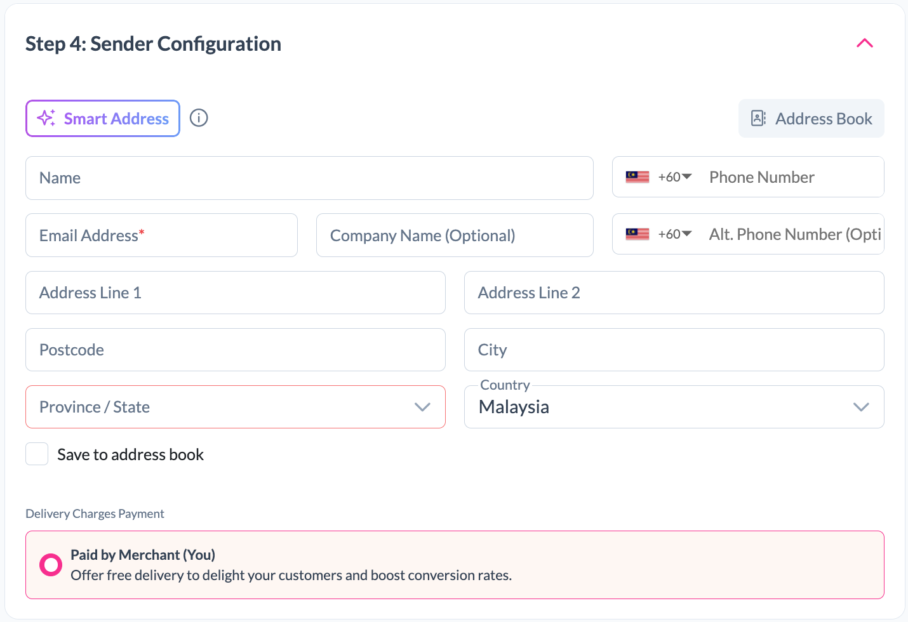
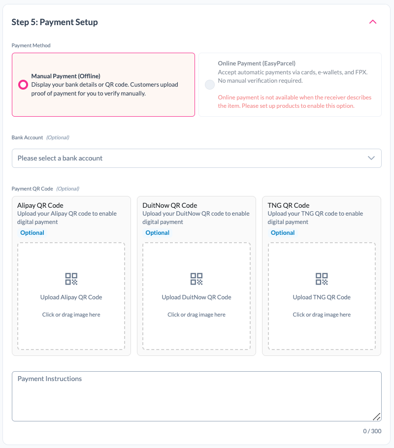
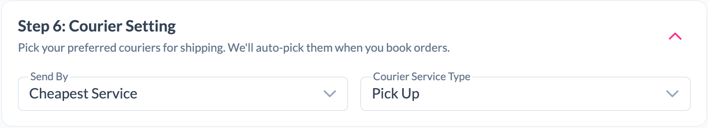
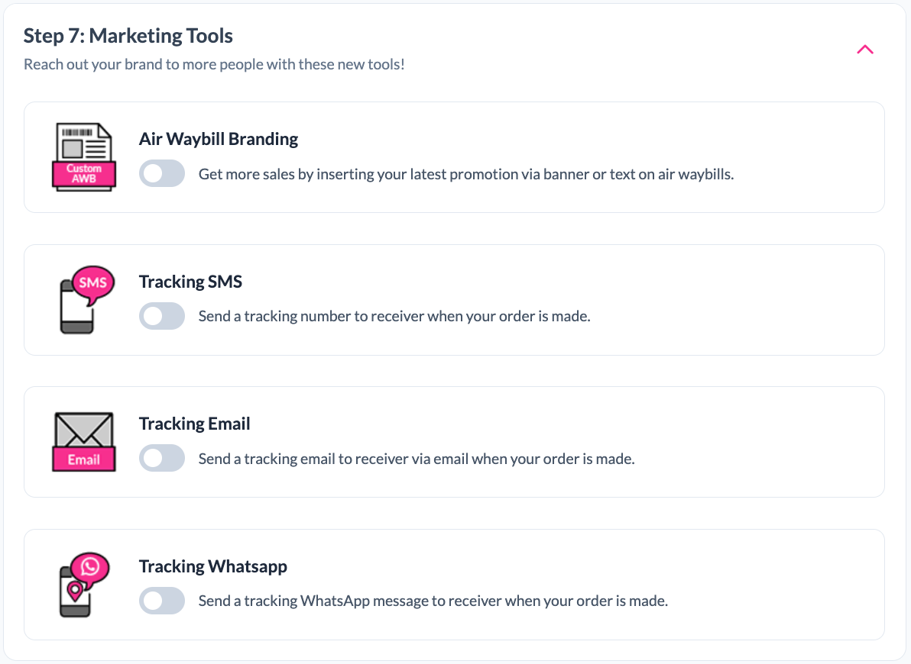

# Form

The Form section allows merchants to create a customised order form for collecting customer orders and delivery details.

<br>

## Step 1: Create Order Form

Click on the "Create Order Form" button to start creating a new Quicksend form.


---

## Step 2: Form Information

Fill in the basic information of your order form.


### Platform

Select the platform where you will share your Quicksend form.

Available platforms:

- Facebook
- WeChat
- LINE
- Instagram
- WhatsApp
- TikTok
- XiaoHongShu
- Other


### Form Name

Enter a name for your form to help identify the order source.

Example: ```Tiktok Live Monday```

---

## Step 3: Branding & Invoicing

### Store
Select a store for this order form.


### Order Success Message
Configure the message displayed after a customer successfully places an order.
```Thank you for shopping with us! Your order has been placed successfully.```

### e-Invoice
Optionally enable e-Invoice for your customers.

---

## Step 4: Product Setup

### Product


### How Should Buyers Choose Products?

Choose how customers will provide their order details.

#### Buyers describe their own order
Best for:

- Custom-made products
- Personalized items
- Donations
- Orders that vary in price or specifications

Customers will enter their own order details during checkout.

#### Sellers list products for selection
Best for:

- Fixed-price products
- Predefined product catalogues
- Standard products with set pricing

Customers can select products directly from the list you have configured.

### Product Description

Optionally provide additional information about your products, such as:

- Product details
- Ordering instructions
- Important notes

---

## Step 5: Sender Configuration


  


### Sender Details

Enter the sender's information:

### Smart Address

Use the **Smart Address** feature to automatically populate address information and reduce manual data entry.

### Address Book

Click **Address Book** to select a previously saved sender address.

### Save to Address Book

Enable **Save to address book** to save the sender information for future use.

### Delivery Charges Payment

The merchant pays the delivery charges, allowing customers to enjoy free shipping.

---

## Step 6: Payment Setup

Configure how customers will make payments for orders submitted through your QuickSend form.

  


### Payment Method

Choose one of the available payment methods.

#### Manual Payment (Offline)

Customers can make payments manually and upload proof of payment for verification.

Optional settings include:

- Bank Account
- Alipay QR Code
- DuitNow QR Code
- TNG QR Code

#### Online Payment (EasyParcel)

Customers can make payments automatically through EasyParcel using:

- Credit Cards
- E-Wallets
- FPX

> **Note**
>
> Online Payment is not available when **Buyers describe their own order** is selected under Product Setup. To enable Online Payment, configure your products using **Sellers list products for selection**.

### Bank Account

Optionally select a bank account to display your banking information to customers.

### Payment QR Codes

Optionally upload payment QR codes to allow customers to make digital payments through:

- Alipay
- DuitNow
- Touch 'n Go (TNG)

### Payment Instructions

Optionally provide additional payment instructions.

---

## Step 7: Courier Setting

Configure your preferred shipping options. QuickSend will automatically use the selected settings when booking orders.

  

### Send By

Choose how the courier service should be selected.

#### Cheapest Service
Automatically selects the lowest shipping rate available for the shipment.

#### Courier Company
Allows you to select a specific courier company for all orders created through the form.

### Courier Service Type

Choose how parcels will be handed over to the courier.

#### Pick Up
The courier collects the parcel from your sender address.

#### Drop Off
You drop off the parcel at the courier's designated branch or drop-off point.

---

## Step 9: Marketing Tools

Enhance your brand visibility and improve customer communication by enabling the available marketing tools.

  

### Air Waybill Branding

Promote your brand by displaying your latest promotion, banner, or custom message on the air waybill.

### Tracking SMS

Send tracking information to customers via SMS once the order has been created.

### Tracking Email

Send tracking information to customers via email once the order has been created.

### Tracking WhatsApp

Send tracking information to customers via WhatsApp once the order has been created.

---

## Step 10: Publish & Preview 🚀

You're almost there!

Click **Publish & Preview** to:

- 🚀 Publish your QuickSend order form
- 👀 Preview the customer ordering experience
- 🔗 Generate your shareable QuickSend link
- ✅ Double-check everything before going live

🎉 Your QuickSend form is now ready to share with your customers!