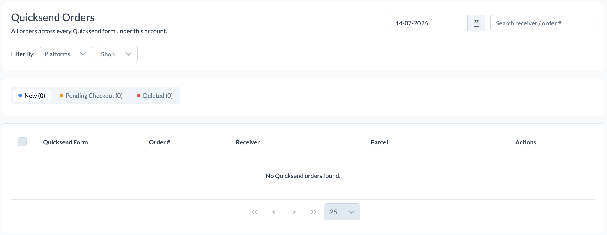

# Orders

The Orders module allows you to manage and monitor all orders submitted through your QuickSend forms.

View orders from all QuickSend forms under your account in one place and easily track their status.

  

## Available Features

### Search Orders

Search for orders by:

- Receiver Name
- Order Number

### Filter Orders

Filter orders by:

- Platform
- Shop
- Date

### Order Status

QuickSend orders are grouped into the following statuses:

#### 🆕 New
Newly submitted orders that are ready for processing.

#### 🛒 Pending Checkout
Orders that have been submitted but have not completed the checkout process.

#### 🗑️ Deleted
Orders that have been deleted and are no longer active.

### Order Information

The order list displays the following information:

- QuickSend Form
- Order Number
- Receiver
- Parcel Details
- Available Actions

✨ Manage all your QuickSend orders in one place and stay on top of every shipment with ease.