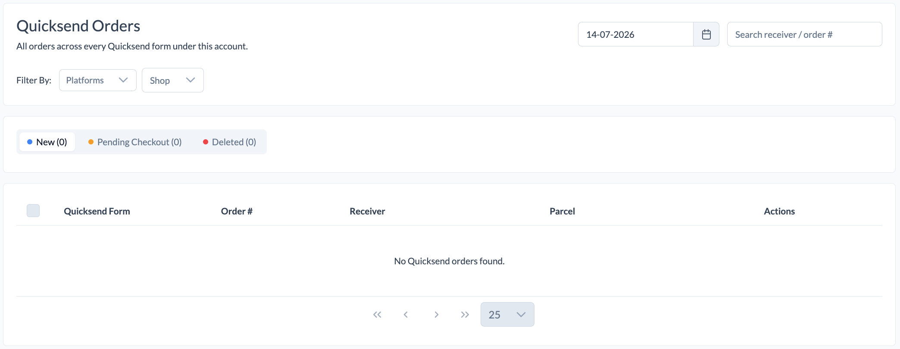
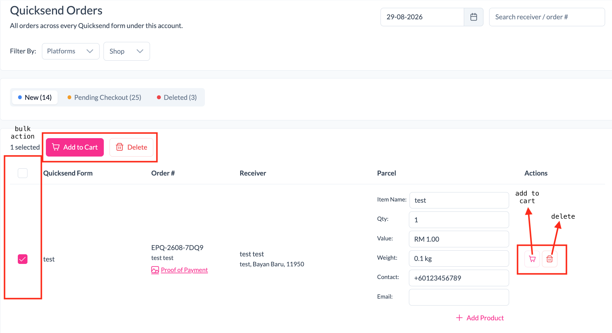
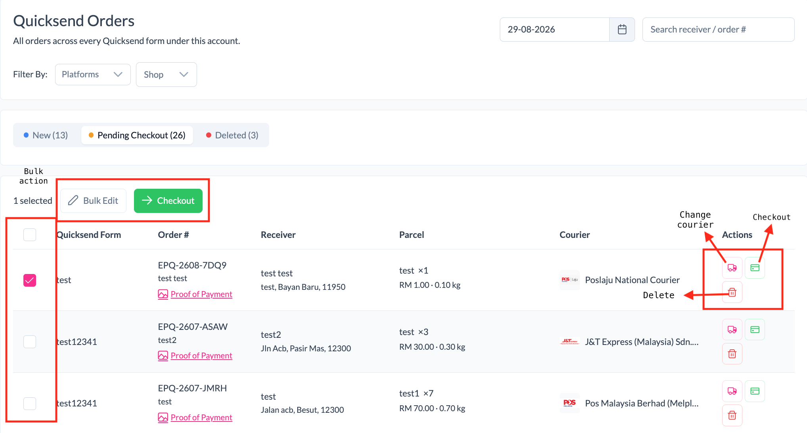
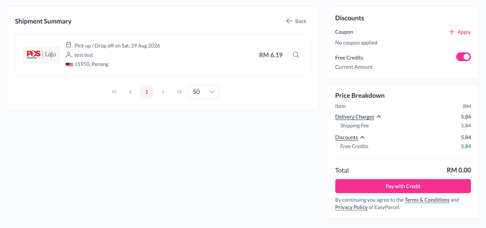

# Orders

The Orders module allows you to manage and monitor all orders submitted through your QuickSend forms.

View orders from all QuickSend forms under your account in one place and easily track their status.

  

## Available Features

### Search Orders

Search for orders by:

- Receiver Name
- Order Number

### Filter Orders

Filter orders by:

- Platform
- Shop
- Date

### Order Status

QuickSend orders are grouped into the following statuses:

#### 🆕 New
Newly submitted orders that are ready for processing.

#### 🛒 Pending Checkout
Orders that have been submitted but have not completed the checkout process.

#### 🗑️ Deleted
Orders that have been deleted and are no longer active.

### Order Information

The order list displays the following information:

- QuickSend Form
- Order Number
- Receiver
- Parcel Details
- Available Actions

✨ Manage all your QuickSend orders in one place and stay on top of every shipment with ease.

## Managing Orders

Orders coming in? 🎉 Let’s get them moving!

From new orders to checkout, QuickSend Orders lets you manage everything in one place.

New orders follow this simple flow

New Order → Add to Cart → Pending Checkout → Checkout → 🚚 Ship

### 1. New Orders

When customers submit their orders, they will appear under the New tab.

You can review the order details, including the QuickSend Form, receiver information, parcel details, and proof of payment.

Ready to move an order forward?

**For a single order**

- Click the cart icon under Actions to add the order to your cart

**For multiple orders**

- Select the orders using the checkboxes
- Click Add to Cart under Bulk Action

Once added to the cart, the orders will move to Pending Checkout.

### 2. Checkout

Your orders are now ready to go! 🛒

Under Pending Checkout, you can review your orders before checking out.

There are two ways to check out your orders.

**Single Checkout**

Want to process just one order? Easy!

- Immediately click the Checkout icon under Actions for an order
- Review the shipment summary
- Complete the checkout

**Bulk Checkout**

Got a bunch of orders ready to go? 🚀 Save some clicks with Bulk Checkout.

- Select the orders you want to check out
- Click Checkout under Bulk Action
- Review the shipment summary
- Complete the checkout

Before checkout, you can select multiple orders and use Bulk Edit to add or update add-ons for all selected orders.

**Available add-ons include**
* Cash on Delivery
* EasyCover
* Collection Date
* Tracking SMS
* Tracking Email
* Tracking WhatsApp

Bulk Checkout lets you process multiple orders at once instead of checking them out one by one.

Once the checkout is completed, the orders will be processed for shipment.

### 🚀📦 And off it goes! Congratulations on your successful shipment! 🎉✨