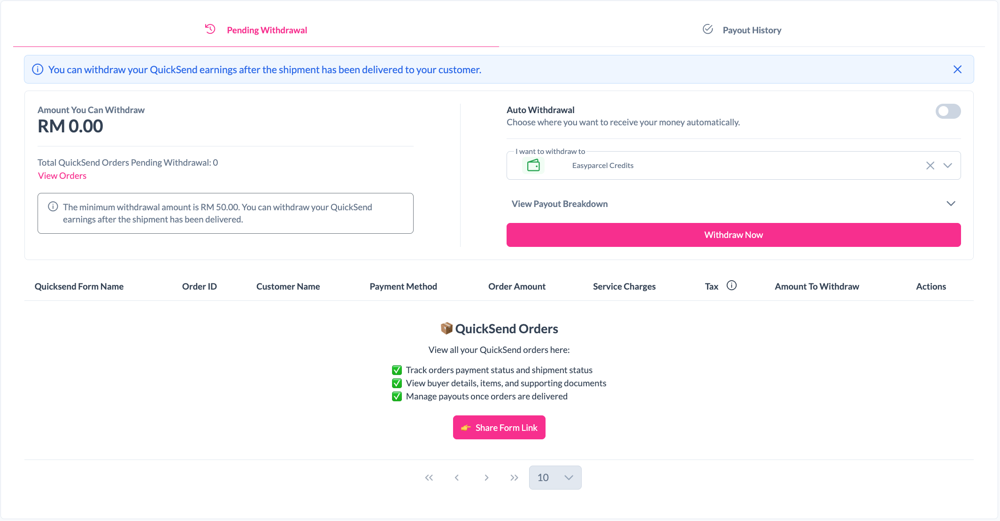
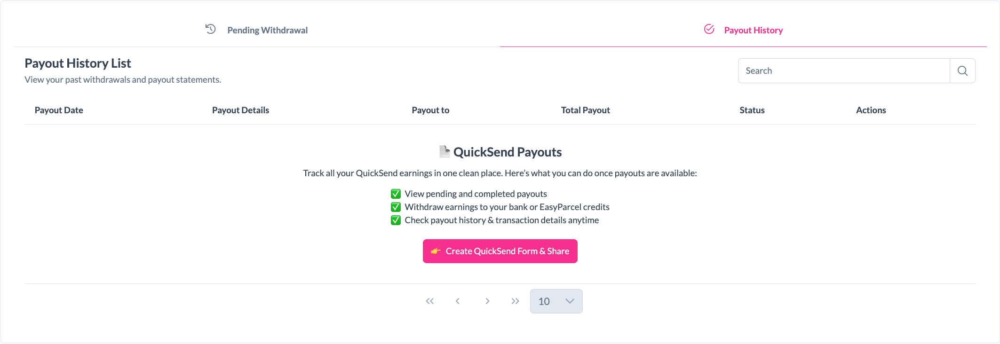

# Payout

The Payout module allows you to track your QuickSend earnings and withdraw funds once eligible orders have been delivered.

Payout consists of two sections:

- Pending Withdrawal
- Payout History

---

## Pending Withdrawal

The **Pending Withdrawal** page displays your available earnings and orders that are eligible for withdrawal.

  

### Available Features

#### Amount You Can Withdraw

View the total amount currently available for withdrawal.

#### Total Orders Pending Withdrawal

Displays the number of QuickSend orders that are awaiting withdrawal.

#### Auto Withdrawal

Enable **Auto Withdrawal** to automatically transfer your earnings to your preferred destination.

#### Withdrawal Destination

Choose where you would like to receive your payouts.

Example:

- EasyParcel Credits

#### Payout Breakdown

Expand the payout breakdown section to review your withdrawal details before submitting.

#### Withdraw Now

Click **Withdraw Now** to request a payout of your available earnings.

> **Note**
>
> QuickSend earnings can only be withdrawn after the shipment has been successfully delivered to your customer.
>
> The minimum withdrawal amount is RM50.00.

---

## Payout History

The **Payout History** page allows you to view your past withdrawals and payout statements.

  

### Available Features

#### Search

Quickly locate a payout record using the search bar.

#### Payout Information

Each payout record displays:

- Payout Date
- Payout Details
- Payout Destination
- Total Payout Amount
- Status
- Available Actions

✨ Track your earnings, monitor withdrawals, and manage your QuickSend payouts all in one place.