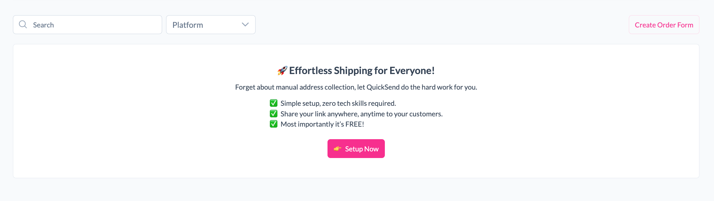
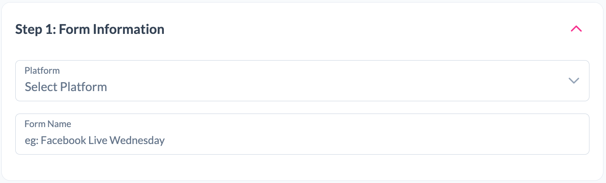
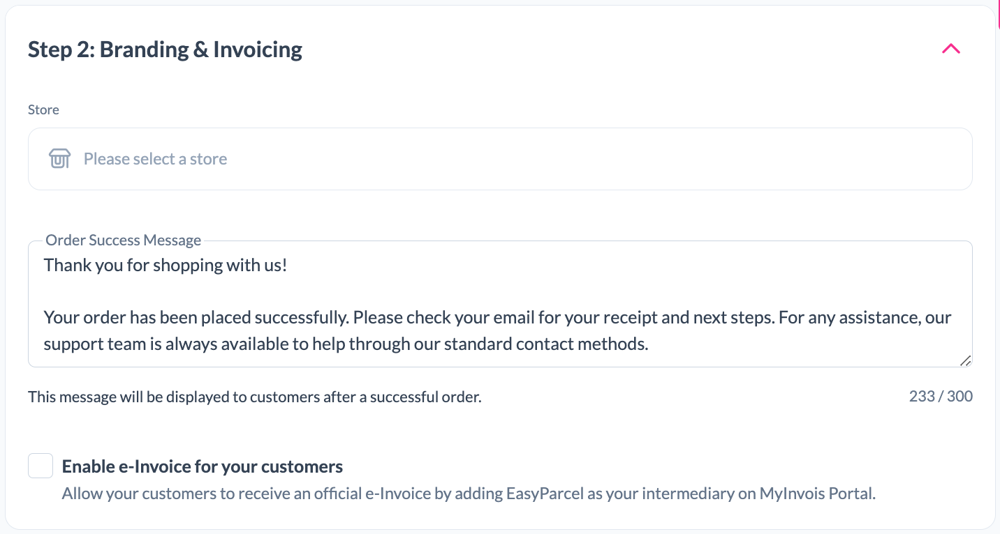
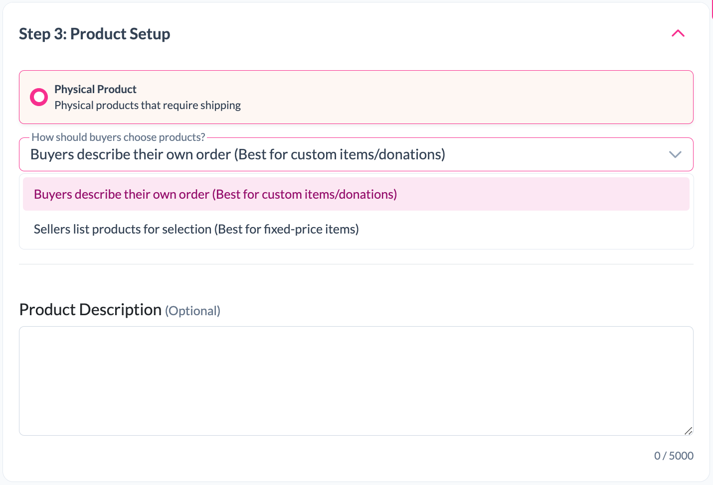

# EasyParcel Quicksend Documentation

## 1. What is EasyParcel Quicksend?

EasyParcel Quicksend is a simple and free shipping solution that allows businesses to collect customer delivery information without manually managing addresses.

With Quicksend, merchants can create a custom order form and share the link with customers through different platforms. Customers can submit their order details, and merchants can manage shipping orders directly through EasyParcel.

🚀 Effortless Shipping for Everyone!

Forget about manual address collection, let QuickSend do the hard work for you.

Benefits of EasyParcel Quicksend:

✅ Simple setup, zero tech skills required.  
✅ Share your link anywhere, anytime to your customers.  
✅ Most importantly, it is FREE!


Supported Platforms:

- Facebook
- WeChat
- LINE
- Instagram
- WhatsApp
- TikTok
- XiaoHongShu
- Other platforms


## 2. Why EasyParcel Quicksend?

EasyParcel Quicksend helps merchants simplify their shipping workflow by reducing manual work and improving order management.

Key advantages:

### Easy Order Collection

Merchants can create a custom order form and share it with customers. Customers can directly provide their delivery details without needing manual communication.

### No Technical Knowledge Required

Quicksend does not require coding or complicated setup. Merchants can create their shipping form through a simple step-by-step process.

### Centralised Order Management

All customer orders collected through Quicksend can be managed from the EasyParcel platform.

### Flexible Sharing Options

The Quicksend link can be shared through multiple social media and communication platforms, allowing merchants to reach customers easily.


# 3. How to Use EasyParcel Quicksend?

To access EasyParcel Quicksend:

1. Login to your EasyParcel account.
2. Navigate to Quicksend from the dashboard.
3. Quicksend contains three main sections:

- Form
- Orders
- Payout


# Form

The Form section allows merchants to create a customised order form for collecting customer orders and delivery details.


## Step 1: Create Order Form

Click on the "Create Order Form" button to start creating a new Quicksend form.





## Step 2: Form Information

Fill in the basic information of your order form.


### Platform

Select the platform where you will share your Quicksend form.

Available platforms:

- Facebook
- WeChat
- LINE
- Instagram
- WhatsApp
- TikTok
- XiaoHongShu
- Other


### Form Name

Enter a name for your form to help identify the order source.

Example: ```Tiktok Live Monday```

## Step 4: Branding & Invoicing

### Store
Select a store for this order form.


### Order Success Message
Configure the message displayed after a customer successfully places an order.
```Thank you for shopping with us! Your order has been placed successfully.```

### e-Invoice
Optionally enable e-Invoice for your customers.

## Step 5: Product Setup

### Product


### How Should Buyers Choose Products?

Choose how customers will provide their order details.

#### Buyers describe their own order
Best for:

- Custom-made products
- Personalized items
- Donations
- Orders that vary in price or specifications

Customers will enter their own order details during checkout.

#### Sellers list products for selection
Best for:

- Fixed-price products
- Predefined product catalogues
- Standard products with set pricing

Customers can select products directly from the list you have configured.

### Product Description

Optionally provide additional information about your products, such as:

- Product details
- Ordering instructions
- Important notes