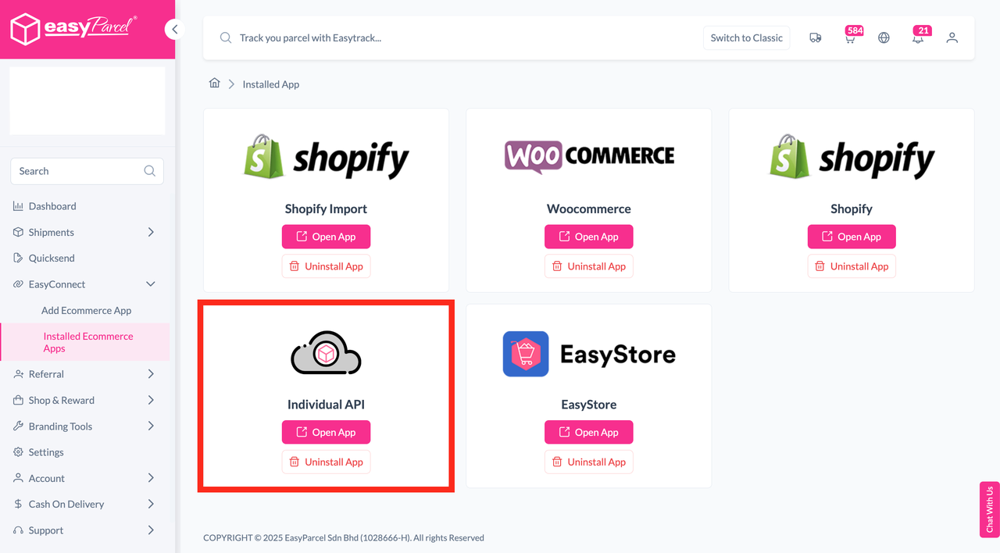
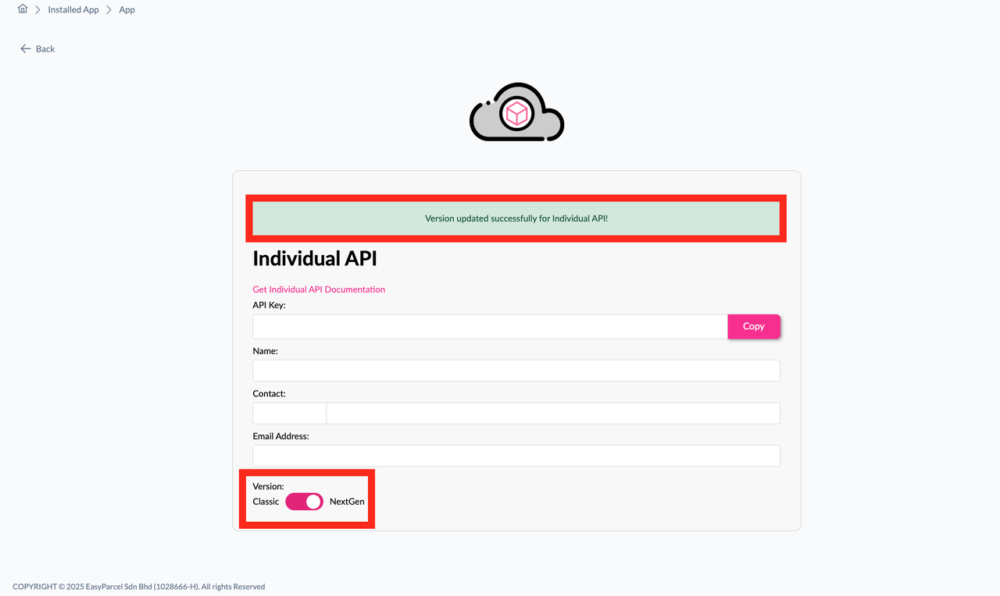
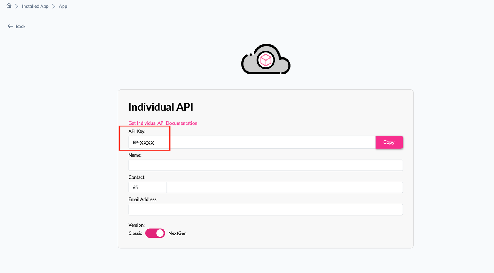
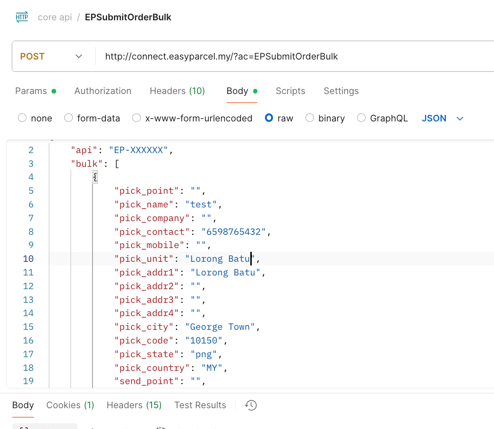

# Switching from Classic to Next Gen for API Integration (MY)

## Table of Contents
- [Navigation Path](#navigation-path)  
- [Steps to Switch](#steps-to-switch)  
- [Using the API Key](#using-the-api-key)  
- [API Documentation](#api-documentation)  
- [Notes](#notes)  

---

## Navigation Path
`EasyConnect -> Installed Ecommerce Apps -> Individual API -> Open App`

---

## Steps to Switch
1. Scroll to the **Version** section at the bottom.  
2. Toggle the switch to **Next Gen**.  

✅ Done! You’ve now switched to **Next Gen**.  

---

## Using the API Key
Once switched, you may proceed to use the **API key** for your API integration.  

---
## Notes
- There are **no changes** to the API parameters or structure at this time.  
- You may continue using the API as per the existing documentation.

Refer to the official API documentation here:  

🔗 [EasyParcel API Documentation (Malaysia)](https://developers.easyparcel.com/?c=Malaysia)  

---

 

