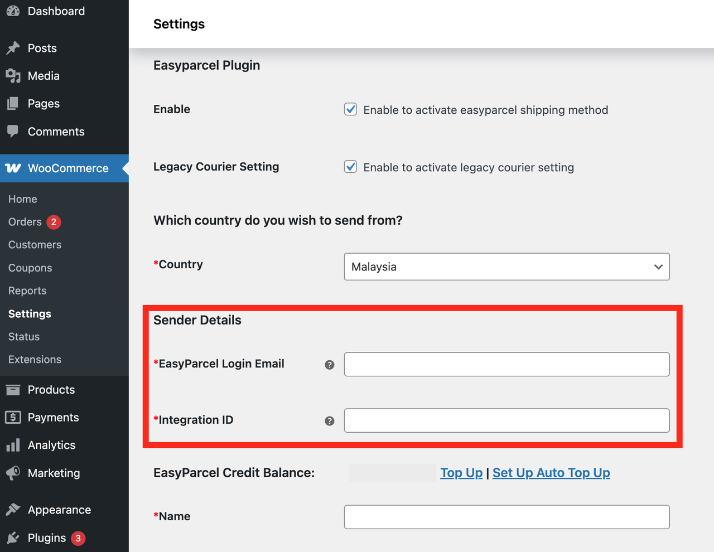

# Switching from Classic to Next Gen for WooCommerce (MY)

## Table of Contents
- [Navigation Path](#navigation-path)  
- [Steps to Switch](#steps-to-switch)  
- [Retrieve API Key](#retrieve-api-key)  
- [Proceed with WooCommerce Plugin Integration](#proceed-with-woocommerce-plugin-integration)  
- [Notes](#notes)  

---

## Navigation Path
`EasyConnect -> Installed Ecommerce Apps -> Individual API -> Open App`

---

## Steps to Switch
1. Go to the **Switch** section.  
2. Toggle the switch to **Next Gen**.  

✅ Done! You’ve now switched to **Next Gen**.  

---

## Retrieve API Key
- Navigate to **Store Details** by pressing the `≡` → **Edit**.

  
- From there, you can retrieve the **API key** for WooCommerce plugin integration.  

---

## Proceed with WooCommerce Plugin Integration
Follow the official guide here:  

🔗 [How to integrate EasyParcel with WooCommerce](https://helpcentre-my.easyparcel.com/support/solutions/articles/9000188606-how-to-integrate-easyparcel-with-woocommerce-)  

---

## Notes
- Once switched, all new settings will apply under **Next Gen**.  
- API keys retrieved here are required for the WooCommerce plugin integration.  

