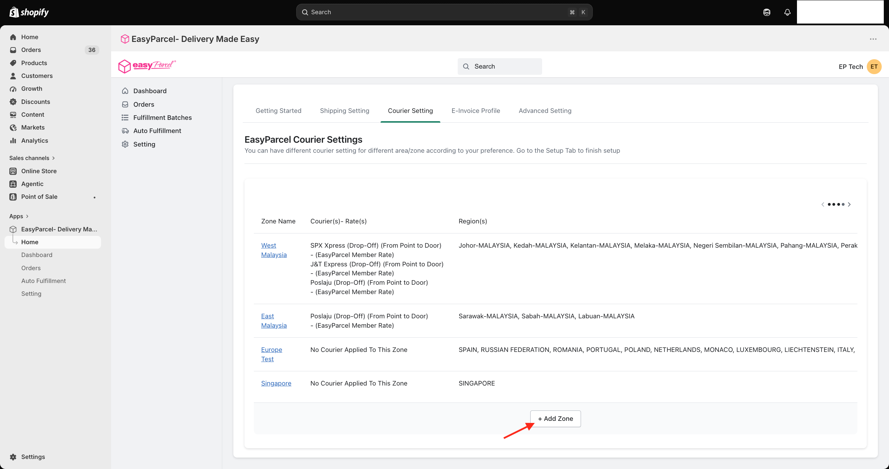
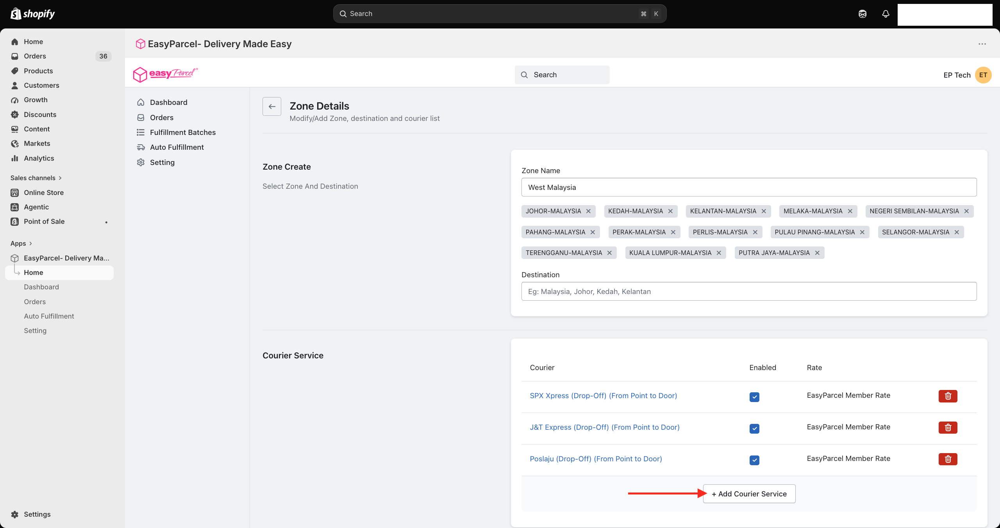

# 🚚 Courier Setting: Pick Your Delivery Squad

> **TL;DR:** Create a zone → add the places you ship to → add your preferred couriers. Repeat for each zone, and you're ready to ship! 🚀

Time to choose which couriers deliver where. 🗺️ Set this up once, and the right courier and rate will show up for every order.

⏱️ **Time needed:** About 5 minutes
📍 **Where:** EasyParcel app in Shopify → **Setting** → **Courier Setting** tab

---

## ✅ Before You Start

- 🔌 Your store is **integrated** ([Integration Guide](Integration-Guide.md))
- 📍 Your **Sender Details** are filled in ([Settings Guide](Settings-Guide.md))

---

## 🗺️ What Are Zones?

Click the **Courier Setting** tab at the top of the **Setting** page.

You'll see your **zones**: groups of places you ship to, each with its own couriers.

| Column | What it shows |
|---|---|
| **Zone Name** | The name of the zone. Click it to edit |
| **Courier(s) - Rate(s)** | The couriers enabled for this zone and their rates |
| **Region(s)** | The states or countries covered by this zone |

> 👀 **Seeing "No Courier Applied To This Zone"?** That zone doesn't have any couriers yet. Click the zone name to add some!

---

## ⚠️ Important: Keep West and East Malaysia Separate!

We **highly recommend** creating **two separate zones** for West Malaysia and East Malaysia. 🇲🇾

Why? Shipping from the Peninsula to Sabah or Sarawak is priced very differently from shipping within the Peninsula. Keeping them separate makes sure the **correct shipping rate is returned** every time. No surprises for you or your customers. 💸

| Zone | States to include |
|---|---|
| 🌴 **West Malaysia** | Johor, Kedah, Kelantan, Melaka, Negeri Sembilan, Pahang, Perak, Perlis, Pulau Pinang, Selangor, Terengganu, Kuala Lumpur, Putrajaya |
| 🌺 **East Malaysia** | Sabah, Sarawak, Labuan |

---

## ➕ Step 1: Add a Zone

1. Click **+ Add Zone**.
2. Give it a **Zone Name** (e.g. "West Malaysia").
3. In the **Destination** box, type and select the states or countries for this zone. Each one appears as a little tag.

> 💡 **Added the wrong state?** Just click the **✕** on its tag to remove it.

---

## 🚛 Step 2: Add Your Preferred Couriers

1. Scroll down to **Courier Service**.
2. Click **+ Add Courier Service**.
3. Pick the courier(s) you'd like to use for this zone.
4. Make sure the **Enabled** box is ticked ✅ for each one you want active.

> 🎯 **Want options?** Add a few couriers per zone. That way you (or your customers) can choose between faster, cheaper, or drop-off vs pickup.

> 🗑️ **Don't need a courier anymore?** Untick **Enabled** to switch it off for now, or click the red bin icon to remove it.

---

## 🔁 Step 3: Repeat for Your Other Zones

Do the same for your **East Malaysia** zone, and any other places you ship to (like Singapore 🇸🇬).

Done? Click the **←** back arrow to return to your zone list.

---

## 🎉 You're Ready to Ship!

That's it! Your store is officially set up! 🥳 Time to send out your first parcel.

There are **three ways** to fulfil your orders. Pick the one that fits your vibe:

| Style | Best for… | Guide |
|---|---|---|
| 🧍 **Single Fulfillment** | Shipping one order at a time, with full control | 👉 [Single Fulfillment Guide](single-fulfillment.md) |
| 👯 **Bulk Fulfillment** | Shipping lots of orders in one go (hello, sale days! 🛍️) | 👉 [Bulk Fulfillment Guide](bulk-fulfillment.md) |
| 🤖 **Auto Fulfillment** | Hands-free shipping, orders process themselves | 👉 [Auto Fulfillment Guide](auto-fulfillment.md) |

> 🤔 **Not sure where to start?** Try **Single Fulfillment** first to get the hang of it, then level up to Bulk or Auto. 📈

---

## ✨ Bonus: Want Live Shipping Rates at Checkout?

Want your customers to see **real-time courier rates** and pick their own courier when they check out? 🛒

It's a great way to be upfront about shipping costs and give your customers more choice.

### 👉 [Set Up Live Rates at Checkout](live-rates.md)

---

## 🙋 Need Help?

We're real humans, and we like helping. 💗

- 🇲🇾 **Malaysia:** [EasyParcel Malaysia Help Centre](https://app.easyparcel.com/my/en/contact-us)
- 🇸🇬 **Singapore:** [EasyParcel Singapore Help Centre](https://app.easyparcel.com/sg/en/contact-us)

---

  <b>Happy shipping! 📦✨</b> 
  <i>EasyParcel — Delivery Made Easy</i>

