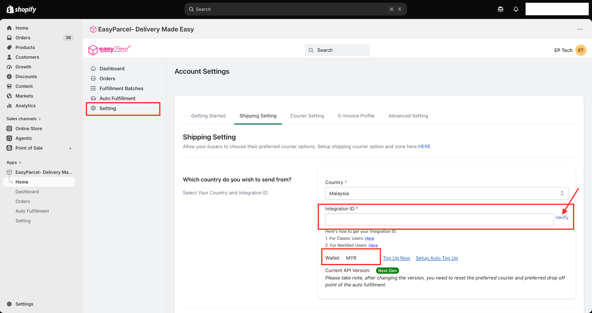
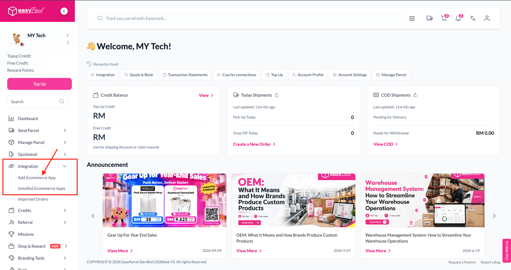
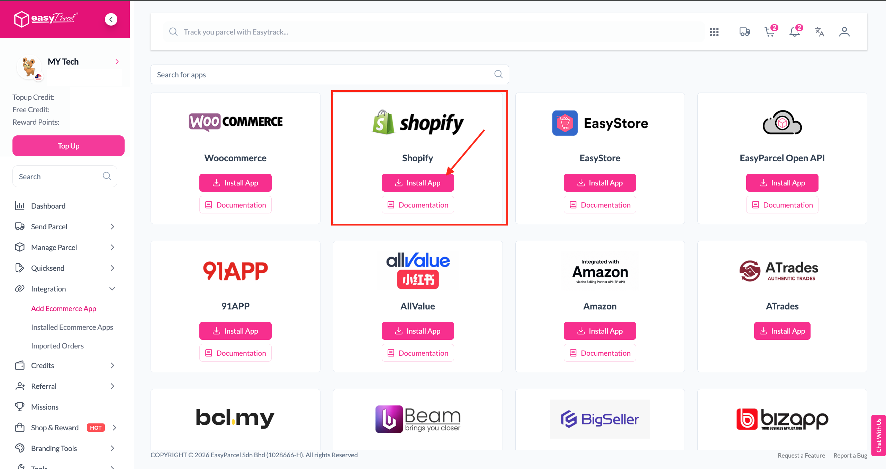
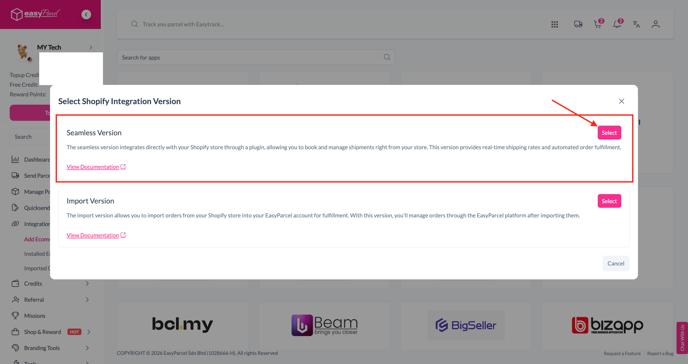
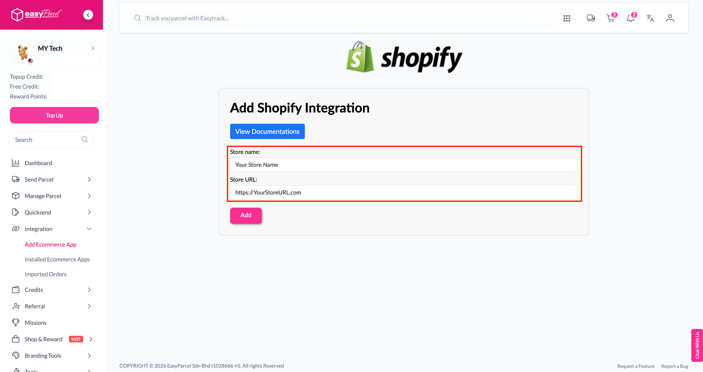
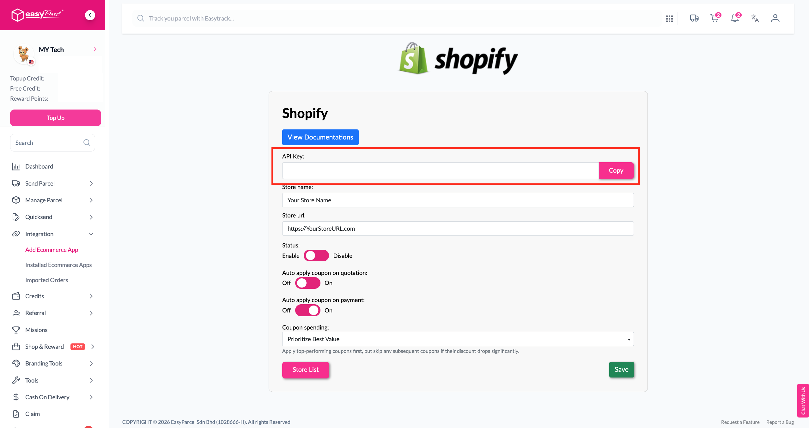

# 🔌 Integration Guide: Connect Shopify to EasyParcel

> **TL;DR:** Grab your API key from EasyParcel → paste it into the Shopify app → click **Verify**. Three moves and you're connected. 🎯

Think of this as introducing two friends who are going to work *really* well together. 🤝 Your Shopify store brings the orders, EasyParcel brings the couriers. Let's make the introduction.

⏱️ **Time needed:** About 5 minutes
🧰 **You'll need:** Your Shopify admin login + your EasyParcel account login

---

## 🗺️ Table of Contents

1. [Step 1: Head to Setting in the Shopify App](#-step-1-head-to-setting-in-the-shopify-app)
2. [Don't Have Your API Key Yet? Let's Grab It!](#-dont-have-your-api-key-yet-lets-grab-it)
3. [Step 2: Paste, Verify, Celebrate](#-step-2-paste-verify-celebrate)
4. [What's Next?](#-whats-next)

---

## ⚙️ Step 1: Head to Setting in the Shopify App

1. Open the **EasyParcel-Delivery Made Easy** app in your Shopify admin.
2. Click **Setting** in the EasyParcel menu.
3. Under the **Shipping Setting** tab, find the **Integration ID** field.

This is where your API key goes. 🔑

Already have your API key? Skip ahead to [Step 2](#-step-2-paste-verify-celebrate). 🏃

Don't know where to find it? No stress — follow along below. 👇

---

## 🕵️ Don't Have Your API Key Yet? Let's Grab It!

Your API key lives in your **EasyParcel account** (not in Shopify). Here's the treasure map. 🗺️

### 🅰️ Go to "Add Ecommerce App"

1. Log in to your **EasyParcel account**.
2. In the left menu, click **Integration**.
3. Click **Add Ecommerce App**.

### 🅱️ Find Shopify and Install

Look for the **Shopify** card and click **Install App**.

> 💡 **Can't spot it?** Use the **Search for apps** bar at the top and type "Shopify".

### ©️ Choose the Seamless Version

A pop-up will ask you to pick a version. Click **Select** on **Seamless Version**.

> 🤔 **Why Seamless?** It's the version that works *inside* your Shopify store — real-time shipping rates at checkout, automated fulfilment, the works. The Import Version is a different setup where you manage orders on the EasyParcel website instead. For this app, **Seamless is the one you want.** ✅

### 🅳 Add Your Store Details

1. Enter your **Store name**.
2. Enter your **Store URL**.
3. Click **Add**.

You'll see a **"Store added successfully"** message. 🎉

### 🅴 Copy Your API Key

You'll be taken straight to your Shopify integration page. Your **API Key** is right at the top.

Click **Copy**. 📋

> 🔒 **Keep it secret, keep it safe.** Your API key connects your store to your EasyParcel wallet. Don't share it in public chats or screenshots.

Got it copied? Back to Shopify we go! 🏃‍♀️

---

## ✅ Step 2: Paste, Verify, Celebrate

1. Go back to the EasyParcel app in Shopify → **Setting** → **Shipping Setting**.
2. Make sure the right **Country** is selected.
3. Paste your API key into the **Integration ID** field.
4. Click **Verify**.

### 🔍 How do I know it worked?

Once verified, you'll see two things appear below the field:

| What you'll see | What it means |
|---|---|
| 💰 **Wallet** (e.g. MYR 100.00) | Your EasyParcel credit balance. Your store can see your wallet! |
| 🏷️ **Current API Version: Next Gen** | You're on the latest and greatest version. ✨ |

> ⚠️ **Seeing "Classic" instead of "Next Gen"?** Double-check you copied the API key from the **Seamless Version** setup. If it still shows **Classic**, please contact our support team and we'll sort it out for you.
 
> 🚫 **Seeing "Error from Easy Parcel: Unauthorized user"?** This usually means the API key didn't paste in exactly right. API keys are long and super picky, so **please don't type it out by hand** ✋⌨️. Go back to your EasyParcel account, click the **Copy** button next to your API key, then paste it into the **Integration ID** field and click **Verify** again. Still getting the error? Contact us via **[Integration Support WhatsApp](https://wa.me/6042023160)** and we'll help you out.

> 💡 **Wallet looking a bit empty?** Click **Top Up Now** so you're ready to ship — or **Setup Auto Top Up** and never worry about it again.

---

## 🎉 You're Connected!

High five! 🙌 Your Shopify store and EasyParcel are officially best friends.

---

## 🚀 What's Next?

Now that you're connected, let's fine-tune how things work — your shipping options, couriers and more.

### 👉 [Continue to the Settings Guide](Settings-Guide.md)

---

  <b>Happy shipping! 📦✨</b> 
  <i>EasyParcel — Delivery Made Easy</i>

