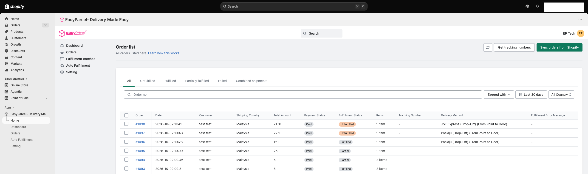

# 📥 The Orders Page: Your Shipping Centre
 
> **TL;DR:** All your Shopify orders live here. Filter them, check their status, and start shipping, all from one screen. 🚀
 
This is where your Shopify orders become real parcels on real trucks. 🚛 Let's take a quick tour so you know exactly what you're looking at.
 
📍 **Where:** EasyParcel app in Shopify → **Orders**
 

 
---
 
## 🔘 The Buttons Up Top
 
| Button | What it does |
|---|---|
| 🔄 **Reload Page** | Refreshes the page so you see the latest view |
| 🔢 **Get tracking numbers** | Fetches the latest AWB (tracking) numbers for your orders |
| 🟢 **Sync orders from Shopify** | Pulls your newest Shopify orders into the app |
 
> 💡 **New order not showing?** Click **Sync orders from Shopify** first. If the order is there but the tracking number isn't, try **Get tracking numbers**.
 
---
 
## 🗂️ The Tabs: Sort Orders by Status
 
| Tab | What you'll find |
|---|---|
| **All** | Every order, all in one place |
| **Unfulfilled** | Orders still waiting to be shipped 👀 *Check this one daily!* |
| **Fulfilled** | Orders that are fully shipped ✅ |
| **Partially fulfilled** | Orders where only some items have shipped so far |
| **Failed** | Orders that couldn't be fulfilled. Check the **Fulfillment Error Message** column to see why |
| **Combined shipments** | Orders going to the same address, shipped together in one parcel with one AWB 📦 |
 
> 💸 **Why combine?** One parcel instead of several means fewer AWBs to print, less packing, and often lower shipping costs.
 
---
 
## 🔍 Search & Filters: Find Any Order, Fast
 
| Tool | Use it to… |
|---|---|
| 🔎 **Order no. search** | Jump straight to a specific order |
| 🏷️ **Tagged with** | Show **Paid** or **Unpaid** orders from Shopify |
| 📅 **Date range** (e.g. Last 30 days) | Narrow orders down by date |
| 🌏 **All Country** | Show orders going to a specific country |
 
---
 
## 📋 Reading the Order List
 
Each row is one order. Here's what the columns tell you:
 
| Column | What it means |
|---|---|
| **Order** | The Shopify order number. Click it to open the order |
| **Date** | When the order was placed |
| **Customer** | Who ordered it |
| **Shipping Country** | Where it's going 🌍 |
| **Total Amount** | The order total |
| **Payment Status** | **Paid** or not. Only paid orders can be fulfilled 💳 |
| **Fulfillment Status** | Unfulfilled, Fulfilled, Partial, Processing or Failed |
| **Items** | How many items are in the order |
| **Tracking Number** | The AWB number once shipped. Shows **-** if not shipped yet |
| **Delivery Method** | The courier your customer picked at checkout (see below 👇) |
| **Fulfillment Error Message** | Why an order failed, if something went wrong |
 
### 🚚 About the Delivery Method column
 
If your customer chose an **EasyParcel courier at checkout**, you'll see it here (e.g. *J&T Express (Drop-Off)*). This happens when you've set up **Live Rates**. ✨
 
If it shows **-**, the customer used a non-EasyParcel shipping method, and you'll pick the courier when you fulfil the order.
 
> ✨ **Want customers to pick their own courier at checkout?** Check out the [Live Rates Guide](live-rates.md).
 
---

## 🚀 Ready to Start Shipping?

Pick the way that fits your vibe:

| Style | Best for… | Guide |
|---|---|---|
| 🧍 **Single Fulfillment** | One order at a time, full control | 👉 [Single Fulfillment Guide](single-fulfillment.md) |
| 👯 **Bulk Fulfillment** | Lots of orders in one go | 👉 [Bulk Fulfillment Guide](bulk-fulfillment.md) |
| 🤖 **Auto Fulfillment** | Hands-free, orders ship themselves | 👉 [Auto Fulfillment Guide](auto-fulfillment.md) |

---

  <b>Happy shipping! 📦✨</b> 
  <i>EasyParcel — Delivery Made Easy</i>

