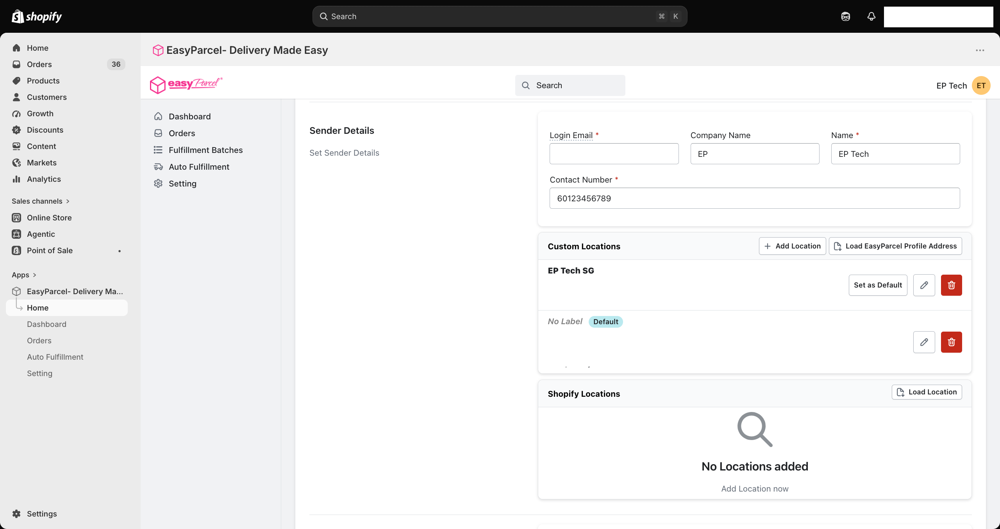
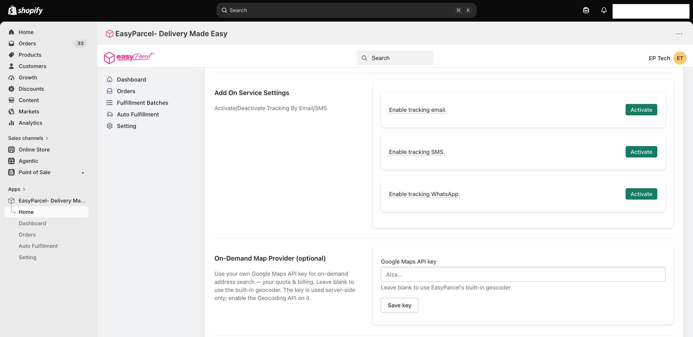
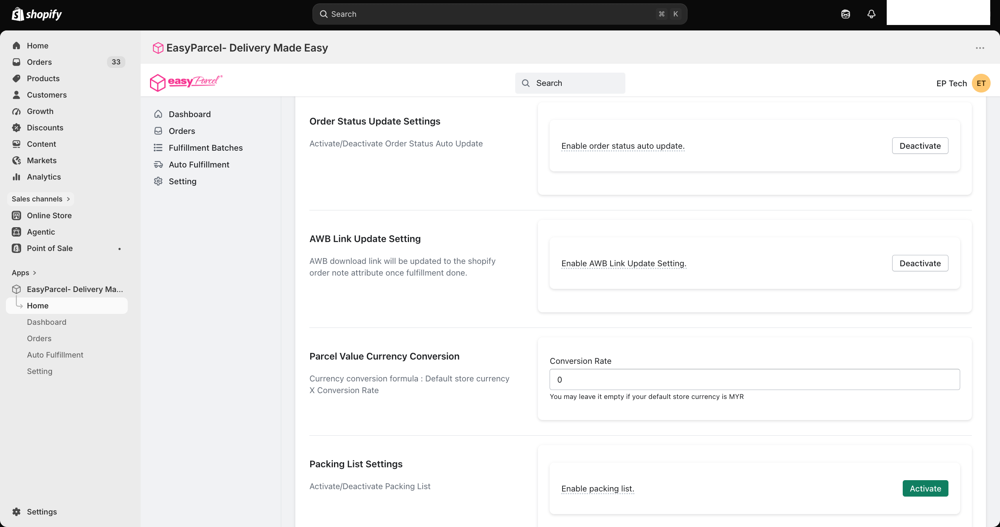
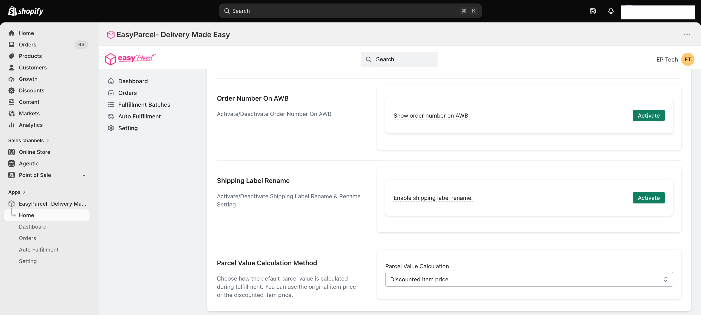

# ⚙️ Account Settings Guide: Get Ready to Ship

> **TL;DR:** Tell us who you are and where you're shipping *from*, then fine-tune your account settings. 🚀

You're connected, nice work! 🙌 Now let's teach the app a few things about your business so every parcel goes out smoothly.

⏱️ **Time needed:** About 5–10 minutes
📍 **Where:** EasyParcel app in Shopify → **Setting**

---

## 🗺️ Table of Contents

1. [Sender Details: Where Are You Shipping From?](#-sender-details-where-are-you-shipping-from)
2. [Tracking Notifications](#-tracking-notifications)
3. [On-Demand Map Provider (Optional)](#-on-demand-map-provider-optional)
4. [Order and AWB Preferences](#-order-and-awb-preferences)
5. [Parcel Value Settings](#-parcel-value-settings)
6. [What's Next?](#-whats-next)

---

## 🏠 Sender Details: Where Are You Shipping From?

Right after you verify your Integration ID, stay on the **Shipping Setting** tab and **scroll down**. 👇 You'll find **Sender Details**.

This is the info couriers use to know who you are and where to pick up your parcels. Let's fill it in.

### 👤 Your details

| Field | What to enter |
|---|---|
| **Login Email** \* | Your EasyParcel login email |
| **Company Name** | Your business name (optional, but looks pro 😎) |
| **Name** \* | The sender's name |
| **Contact Number** \* | A number couriers can reach you on |

> 💡 **Fields marked with \* are required.** Make sure the contact number is one you actually pick up. Couriers may call before a pickup!

### 📍 Your pickup addresses

Here's the fun part: **you can add more than one address!** 🎉 Perfect if you have a shop, a warehouse, and that extra storeroom at home.

| Button | What it does |
|---|---|
| ➕ **Add Location** | Add a new pickup address manually |
| 📄 **Load EasyParcel Profile Address** | Pull in the address you already saved in your EasyParcel account. No retyping! |
| 📄 **Load Location** (under Shopify Locations) | Pull in the locations you've already set up in Shopify |
| ⭐ **Set as Default** | Make this your main shipping-from address |
| ✏️ / 🗑️ | Edit or delete an address |

> 🎯 **Pro tip:** Set your most-used address as **Default**. It'll be picked automatically, so you won't have to choose every time.

---

## 🔔 Tracking Notifications

Keep scrolling down to **Add On Service Settings**. Here you can send your customers tracking updates automatically, so they always know where their parcel is. 📲

| Option | What your customer gets |
|---|---|
| 📧 **Enable tracking email** | Tracking updates by email |
| 💬 **Enable tracking SMS** | Tracking updates by SMS |
| 🟢 **Enable tracking WhatsApp** | Tracking updates on WhatsApp |

Click **Activate** on the ones you'd like to turn on.
 
> 💸 **Heads up: these are paid add-ons.** Each tracking notification comes with an **additional charge** once it's activated. Only turn on the ones your customers will really use. You can **Deactivate** them anytime.
 
> 💡 **How to tell if something is on:** A green **Activate** button means the feature is currently **off**. A white **Deactivate** button means it's already **on**. This works the same for every on/off setting on this page.

---

## 📍 On-Demand Map Provider (Optional)

This one is optional, and most merchants can skip it. 😉

The app already has a built-in address search for **On-Demand delivery**. If you'd rather use your own **Google Maps API key**, paste it into the field and click **Save key**.

| Good to know | |
|---|---|
| 💳 **Billing** | The key uses your own Google quota and billing |
| ⚙️ **Setup** | Make sure the **Geocoding API** is enabled on your key |
| ✅ **No key?** | Leave it blank to keep using EasyParcel's built-in geocoder |

---

## 🔧 Order and AWB Preferences

A handful of switches to make your day-to-day shipping smoother. ✨

| Setting | What it does |
|---|---|
| 🔄 **Order Status Update** | Automatically updates your Shopify order status as your parcels move along |
| 🔗 **AWB Link Update** | Once an order is fulfilled, the AWB download link is added to the order's note attributes in Shopify. Handy for finding it later! |
| 📋 **Packing List** | Turns on packing lists, so you know exactly what goes into each parcel |
| 🔢 **Order Number On AWB** | Prints the order number on the AWB, so you can match parcels to orders at a glance |
| 🏷️ **Shipping Label Rename** | Turns on shipping label renaming and its rename setting |

> 🎯 **Pro tip:** Turn on **Order Number On AWB** if you pack lots of parcels at once. No more guessing which label goes on which box! 📦

---

## 💰 Parcel Value Settings

These control how the **declared value** of your parcels is worked out.

### 🧮 Parcel Value Calculation Method

Choose how the default parcel value is calculated when you fulfil an order:

| Option | Uses… |
|---|---|
| **Original item price** | The item's full price, before any discounts |
| **Discounted item price** | The price your customer actually paid, after discounts |

### 💱 Parcel Value Currency Conversion

Selling in a currency other than MYR/SGD? Enter a **Conversion Rate** so your parcel value is converted correctly.

**The formula:** Default EasyParcel account currency × Conversion Rate

> 🧮 **Example:** If your store sells in USD and you enter a rate of **4.2**, an item worth USD 10 is declared as **MYR 42**.

> ✅ **Store already in MYR/SGD?** Leave this empty.

---

## 🚚 What's Next?

Your account is all set! Now let's choose which couriers deliver where.

### 👉 [Set Up Your Couriers](Courier-Setting.md)

---

  <b>Happy shipping! 📦✨</b> 
  <i>EasyParcel — Delivery Made Easy</i>

