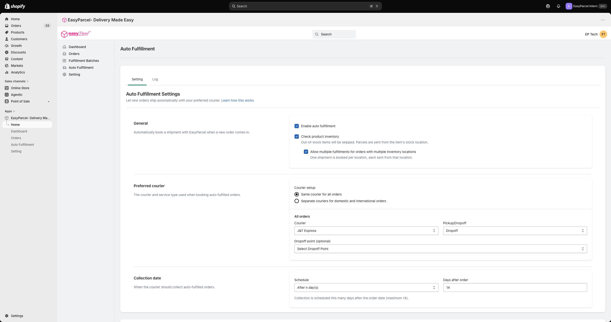
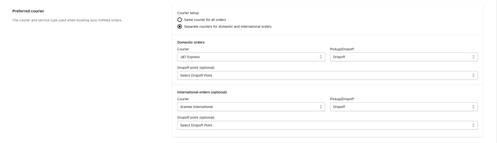
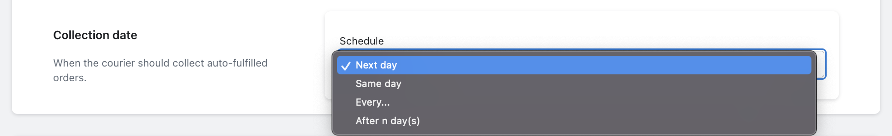
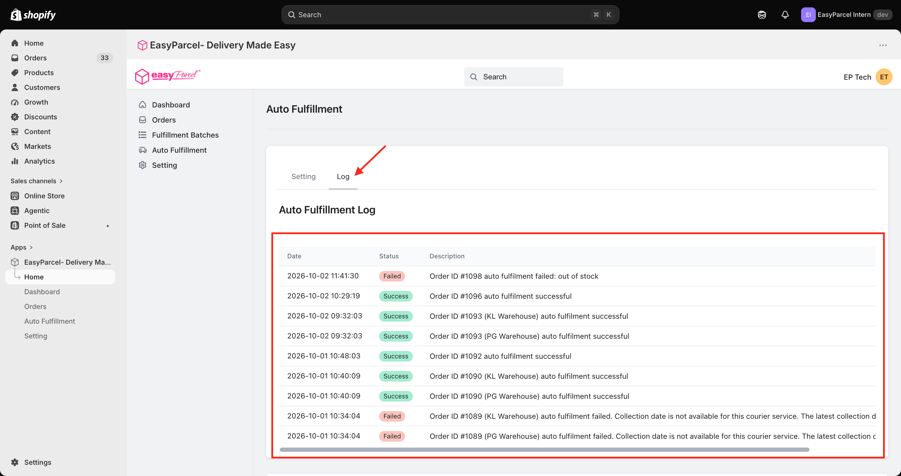

# 🤖 Auto Fulfillment Guide: Shipping on Autopilot
 
> **TL;DR:** Tick **Enable auto fulfillment** → pick your preferred courier → choose a collection date. New orders now ship themselves. ✨
 
This is the feature that makes merchants say *"why didn't I turn this on sooner?"* 🤩
 
With Auto Fulfillment on, every new order is booked with EasyParcel automatically — courier picked, AWB generated, tracking synced. All you do is pack and hand it over. Go have lunch. 🍜
 
⏱️ **Time needed:** About 2 minutes to set up, then zero
📍 **Where:** EasyParcel app in Shopify → **Auto Fulfillment** → **Setting** tab
 
---
 
## ✅ Before You Start
 
- 🔌 Your store is **integrated** ([Integration Guide](Integration-Guide.md))
- 📍 Your **Sender Details** and **courier zones** are set up ([Settings Guide](Settings-Guide.md))
- 💰 Your wallet has credit — and ideally **Auto Top Up** is on (more on that below 👇)
---
 
## 🔛 Step 1: Turn It On (General)
 
Click **Auto Fulfillment** in the EasyParcel menu. You'll land on the **Setting** tab.
 

 
Under **General**:
 
| Option | What it does |
|---|---|
| ✅ **Enable auto fulfillment** | The main switch! New orders are booked with EasyParcel automatically |
| 📦 **Check product inventory** | Skips items that are **out of stock**, and sends parcels from wherever the item is stocked |
| 🏬 **Allow multiple fulfillments for orders with multiple inventory locations** | If an order's items are stocked in different places, one shipment is booked **per location**, each sent from that location |
 
> 💡 **Got more than one warehouse?** Turn on both inventory options. An order with items in your KL and Penang warehouses will be split into two parcels, each shipped from the right place. 🗺️
 
---
 
## 🚚 Step 2: Choose Your Preferred Courier
 
This is the courier the app uses when booking auto-fulfilled orders.
 
First, pick your **Courier setup**:
 
| Setup | Best for… |
|---|---|
| **Same courier for all orders (Legacy Setting)** | Keeping it simple — one courier for everything |
| **Separate couriers for domestic and international orders** | Using different couriers for local and overseas parcels 🌏 |
 
Then fill in:
 
| Field | What to do |
|---|---|
| **Courier** | Pick your courier (e.g. J&T Express) |
| **Pickup/Dropoff** | **Pickup** = the courier comes to you 🏠 · **Dropoff** = you bring it to a drop-off point 🏪 |
| **Dropoff point** *(optional)* | Choose your preferred drop-off point |
 

 
> 🌏 **Shipping overseas sometimes?** Choose **Separate couriers**. The **International orders** section is optional, so you can fill it in whenever you're ready.
 
---
 
## 📅 Step 3: Set the Collection Date
 
Tell the app when the courier should collect your auto-fulfilled orders.
 

 
| Schedule | How it works |
|---|---|
| ⏭️ **Next day** | Collected the day after the order comes in |
| ⚡ **Same day** | Collected on the same day |
| 🗓️ **Every…** | Collected on a set **day of the week** (e.g. every Monday) |
| ⏳ **After n day(s)** | Collected a set number of days after the order date (**maximum 14**) |
 
> 💡 **Batching your shipments?** **Every…** is great if you prefer to pack and hand over everything on one day each week.
 
That's it — you're on autopilot! 🎉
 
---
 
## 🧠 How Does It Pick a Courier?
 
It depends on what your customer chose at checkout:
 
| If your customer chose… | Auto Fulfillment uses… |
|---|---|
| An **EasyParcel shipping method** | The courier your customer picked 🙋 |
| A **non-EasyParcel shipping method** | Your **preferred courier** from Step 2 ⭐ |
 
> ✨ **Want customers to pick their own courier?** Check out the [Live Rates Guide](live-rates.md).
 
---
 
## 📜 Step 4: Check the Log
 
Curious what the app has been up to? 🕵️ Click the **Log** tab.
 

 
Every order the app tried to fulfil shows up here:
 
| Column | What it shows |
|---|---|
| **Date** | When the app tried to fulfil the order |
| **Status** | ✅ **Success** or ❌ **Failed** |
| **Description** | What happened, including the reason if it failed |
 
> 🏬 **Seeing the same order twice?** If you've turned on multiple inventory locations, each location gets its own row (e.g. *KL Warehouse* and *PG Warehouse*).
 
### 😅 Common reasons an order fails
 
| Uh-oh… | Try this |
|---|---|
| **Out of stock** | Restock the item, then fulfil the order manually |
| **Collection date not available for this courier service** | Try a different **Collection date** schedule, or fulfil the order manually |
 
Failed orders can always be shipped by hand using [Single](single-fulfillment.md) or [Bulk Fulfillment](bulk-fulfillment.md). 🙌
 
---
 
## ⚠️ Keep These in Mind
 
| Heads up! | Why it matters |
|---|---|
| 💰 **Keep your credit topped up** | No credit = no shipping. Turn on **Setup Auto Top Up** in **Setting** so you never run dry |
| 🔄 **Changed your API version?** | You'll need to **reset your preferred courier and drop-off point** here |
| 👀 **Check your log now and then** | Catch anything that failed early |
 
---

## 🙋 Need Help?

We're real humans, and we like helping. 💗

- 🇲🇾 **Malaysia:** [EasyParcel Malaysia Help Centre](https://app.easyparcel.com/my/en/contact-us)
- 🇸🇬 **Singapore:** [EasyParcel Singapore Help Centre](https://app.easyparcel.com/sg/en/contact-us)

---

  <b>Happy shipping! 📦✨</b> 
  <i>EasyParcel — Delivery Made Easy</i>

