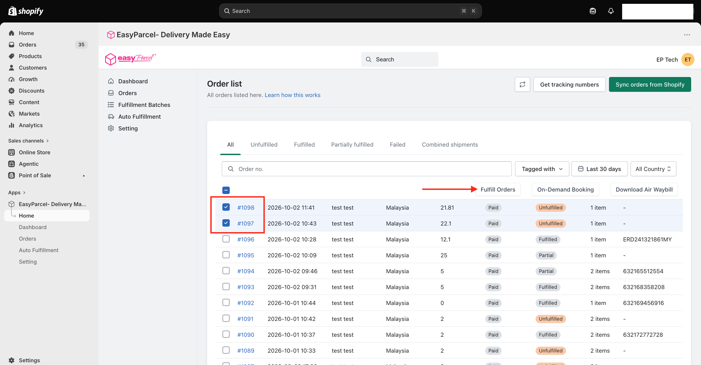
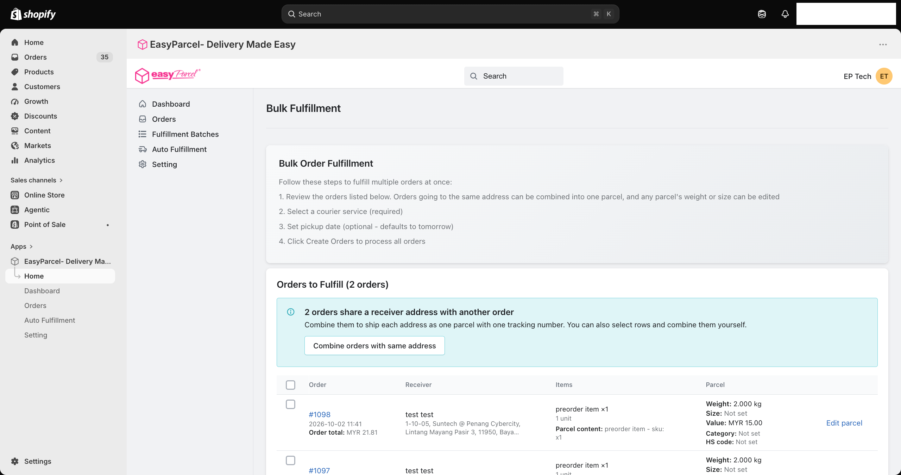
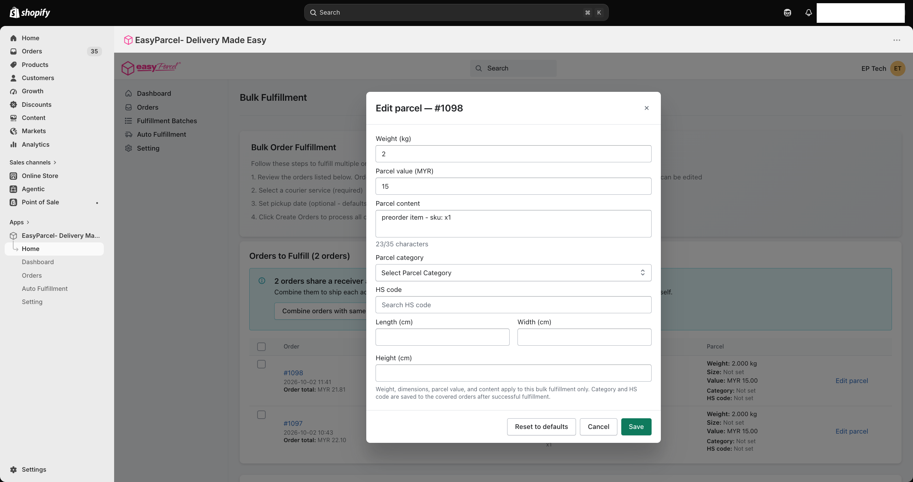
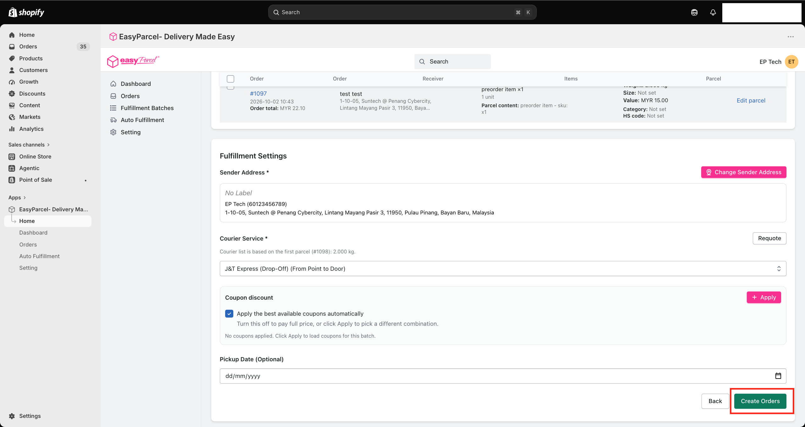
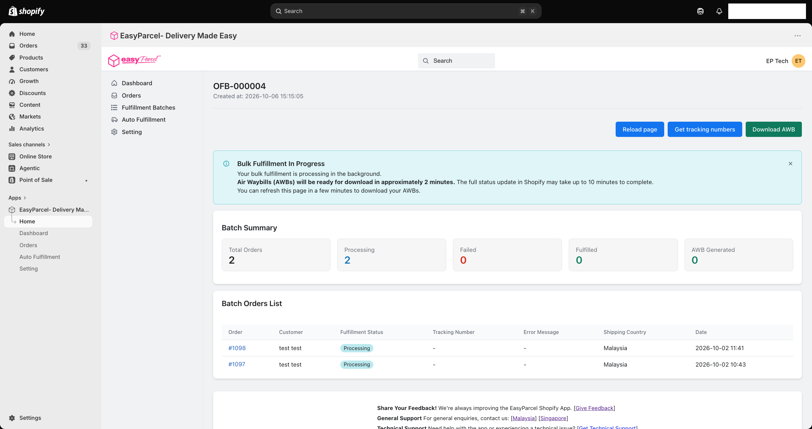
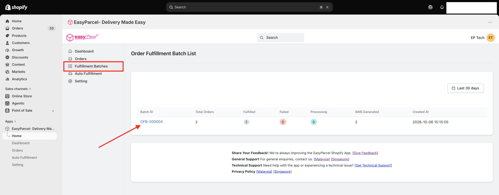

# 👯 Bulk Fulfillment Guide: Ship Many Orders at Once
 
> **TL;DR:** Tick your orders → **Fulfill Orders** → review → pick a courier → **Create Orders**. All your AWBs, ready in about 2 minutes. 🖨️
 
Got a mountain of orders? 🏔️ Don't ship them one by one like it's 2005. Bulk fulfilment lets you process a whole stack in one go — perfect for busy days and big sales like 11.11 and 12.12. 🛍️
 
⏱️ **Time needed:** A few minutes, no matter how many orders
📍 **Where:** EasyParcel app in Shopify → **Orders**
 
---
 
## ✅ Before You Start
 
- 🔌 Your store is **integrated** ([Integration Guide](Integration-Guide.md))
- 📍 Your **Sender Details** and **courier zones** are set up ([Settings Guide](Settings-Guide.md))
- 💳 All orders are marked **Paid**
- 💰 You have **enough credit** to cover *all* the orders (bulk adds up fast! 💸)
> 🆕 **First time shipping?** Try the [Single Fulfillment Guide](single-fulfillment.md) once first. Bulk works the same way, just with more orders.
 
---
 
## ☑️ Step 1: Select Your Orders
 
1. Go to **Orders**.
2. Tick the **checkbox** next to each order you want to ship.
3. Click **Fulfill Orders**.

 
> 💡 **Tip:** Click the **Unfulfilled** tab first to see only orders waiting to ship, then tick away!
 
---
 
## 🔍 Step 2: Review Your Orders
 
You'll land on the **Bulk Fulfillment** page. Each order is listed with its **receiver**, **items** and **parcel details** (weight, size, value, category and HS code).
 

 
### 📦 Combine orders going to the same address
 
Shipping to the same customer more than once? The app spots it for you! 🕵️ Click **Combine orders with same address** to ship them as **one parcel with one tracking number**.
 
You can also tick specific rows and combine them yourself.
 
> 💸 **Why combine?** One parcel instead of several means fewer AWBs to print, less packing, and often lower shipping costs.
 
---
 
## ✏️ Step 3: Edit a Parcel (If Needed)
 
Need to tweak a parcel? Click **Edit parcel** on that order.
 

 
| Field | What to do |
|---|---|
| **Weight (kg)** | The parcel's actual weight |
| **Parcel value** | The declared value of the items |
| **Parcel content** | A short description of what's inside (max 35 characters) |
| **Parcel category** | The category that best describes your items |
| **HS code** | The code that matches your product (important for international shipments 🌏) |
| **Length, Width, Height (cm)** | The parcel's size |
 
Click **Save** when you're done, or **Reset to defaults** to undo your changes.
 
> 📝 **Good to know:** Weight, size, value and content changes apply to **this bulk fulfillment only**. Category and HS code are saved to the order once it's fulfilled successfully.
 
---
 
## 🚚 Step 4: Review Fulfillment Settings
 
Scroll down to **Fulfillment Settings**.
 

 
| Setting | What to do |
|---|---|
| 🏠 **Sender Address** \* | Your default address is selected. Click **Change Sender Address** to use another one |
| 🚚 **Courier Service** \* | Pick the courier for this batch (required!) |
| 🎟️ **Coupon discount** | Tick **Apply the best available coupons automatically**, or click **Apply** to pick your own |
| 📅 **Pickup Date** *(optional)* | Choose a pickup date. If you leave it empty, it defaults to **tomorrow** |
 
> ⚖️ **Heads up:** The courier list is based on the **first parcel's weight**. Edited a parcel or combined orders? Click **Requote** to refresh the courier options.
 
---
 
## 🚀 Step 5: Click Create Orders
 
Everything looks good? Click **Create Orders**. 🎉
 
---
 
## ⏳ Step 6: Grab Your AWBs
 
Your batch is now processing in the background. You'll be taken to the batch page.
 

 
| Timing | What happens |
|---|---|
| ⏱️ **~2 minutes** | Your **AWBs are ready** to download |
| ⏱️ **Up to 10 minutes** | Order statuses fully update in Shopify |
 
Grab a kopi ☕, then click **Reload page** and hit **Download AWB**. 🖨️
 
### 📊 Reading the batch page
 
| Section | What it shows |
|---|---|
| **Batch Summary** | Total orders, and how many are Processing, Failed, Fulfilled, and have AWBs generated |
| **Batch Orders List** | Each order's status, tracking number and any error message |
 
> 🔢 **Tracking numbers not showing yet?** Click **Get tracking numbers** to fetch the latest ones.
 
> ❌ **Something failed?** Check the **Error Message** column to see what went wrong.
 
---
 
## 📋 Finding Your Batch Later
 
Every bulk shipment is saved as a **batch** with its own ID (e.g. **OFB-000004**).
 
1. Click **Fulfillment Batches** in the EasyParcel menu.
2. Click the **Batch ID** to open it.

 
> 💡 **Handy for:** "Wait, did I already print labels for this morning's orders?" Just check your latest batch. 🧐
 
---
 
## 🤖 Want Even Less Work?
 
If you're bulk shipping every day, it might be time to let the app do it for you.
 
### 👉 [Try Auto Fulfillment](auto-fulfillment.md)
 
---

## 🙋 Need Help?

We're real humans, and we like helping. 💗

- 🇲🇾 **Malaysia:** [EasyParcel Malaysia Help Centre](https://app.easyparcel.com/my/en/contact-us)
- 🇸🇬 **Singapore:** [EasyParcel Singapore Help Centre](https://app.easyparcel.com/sg/en/contact-us)

---

  <b>Happy shipping! 📦✨</b> 
  <i>EasyParcel — Delivery Made Easy</i>

