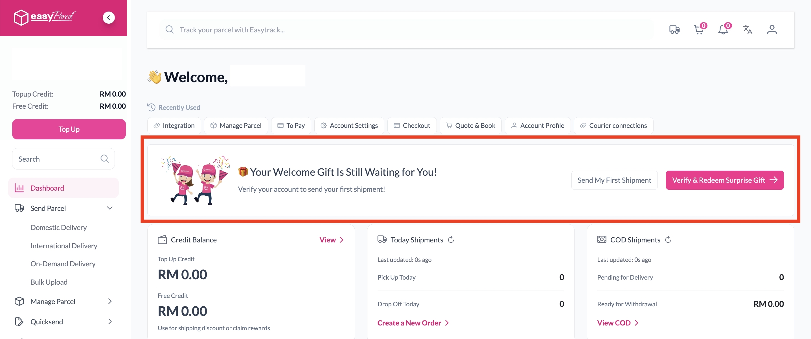

# 🙋 FAQ: Quick Fixes for Common Issues

> **TL;DR:** Something not working? Find your problem below. Most fixes take less than a minute! ⚡

---

**❓ Error from Easy Parcel: Unauthorized user.**

This usually means the API key wasn't pasted in exactly right. API keys are long and super picky, so **please don't type it out by hand** ✋⌨️. Go back to your EasyParcel account, click the **Copy** button next to your API key, paste it into the **Integration ID** field and click **Verify** again.

---

**❓ Error from Easy Parcel: Unverified account.**

Your EasyParcel account needs to be verified before you can ship. 🔐

1. Log in to your EasyParcel dashboard at **[app.easyparcel.com/dashboard](https://app.easyparcel.com/dashboard)**.
2. Look for the **Your Welcome Gift Is Still Waiting for You!** banner.
3. Click **Verify & Redeem Surprise Gift** and follow the steps. 🎁

Once your account is verified, head back to the app and try again.

---

**❓ My API version shows "Classic" instead of "Next Gen."**

Double-check that you copied the API key from the **Seamless Version** setup. If it still shows **Classic**, Immediately contact our Support Team and we'll sort it out for you.

---

**❓ My Dashboard is empty and no orders are showing up.**

Your store probably isn't fully connected to EasyParcel yet. Follow the 👉 [Integration Guide](Integration-Guide.md) to finish setting up.

---

**❓ A new order isn't showing in the Orders page.**

Click **Sync orders from Shopify** to pull in your latest orders. Also make sure the order is marked **Paid**, as only paid orders can be fulfilled. 💳

---

**❓ The tracking number isn't showing for my order.**

Click **Get tracking numbers** on the Orders page (or on the batch page for bulk shipments) to fetch the latest ones. 🔢

---

**❓ An order is in the "Failed" tab. Why?**

Check the **Fulfillment Error Message** column on the Orders page. It tells you exactly what went wrong.

---

**❓ The shipping price is higher than I expected.**

Couriers charge by **chargeable weight**: whichever is higher between the actual weight and the size-based (volumetric) weight. A big, light box can cost more than you'd think! Double-check your parcel's **weight and dimensions** before fulfilling. 📏

---

**❓ Why is the shipping price in the Shopify app higher than on the EasyParcel website?**

Don't worry, you're not being charged more! 😊 The two prices just show different things:

| Where | What the price includes |
|---|---|
| 🛍️ **EasyParcel Shopify app** | The **final price** you'll pay: base shipping rate + **tax** + any **add-on services** you've enabled |
| 🌐 **EasyParcel website** | The **base shipping rate only**, before tax and add-ons |

> 💡 **Want to lower the price?** Check which **add-on services** you've turned on in **Setting**. Tracking email, SMS and WhatsApp come with additional charges.

---

**❓ The Parcel Content field won't accept my text.**

Parcel Content allows a **maximum of 35 characters**, and **alphabetical letters only** (non-alphabetical letters are not accepted). ✏️

---

**❓ I don't have enough credit to fulfil my order.**

Click **Top Up Now** to add credit, or **Setup Auto Top Up** so you never run dry again. 💰

---

**❓ I fulfilled an order by mistake. Can I undo it?**

Yes! Open the order and click **Cancel Fulfillment**. ↩️

---

**❓ My bulk AWBs aren't ready to download yet.**

Bulk fulfilment runs in the background. Your **AWBs are ready in about 2 minutes**, and order statuses in Shopify can take **up to 10 minutes** to fully update. Take a quick break, then click **Reload page** and **Download AWB**. 👉 [Bulk Fulfillment Guide](bulk-fulfillment.md)

---

**❓ The courier list in bulk fulfilment doesn't look right.**

The courier list is based on the **first parcel's weight**. If you've edited a parcel or combined orders, click **Requote** to refresh the courier options. 🔄

---

**❓ Some orders in my bulk batch failed.**

Open the batch from **Fulfillment Batches** and check the **Error Message** column to see what went wrong. You can ship failed orders again using 👉 [Single Fulfillment](single-fulfillment.md).

---

**❓ Auto Fulfillment says "auto fulfilment failed: out of stock."**

You've turned on **Check product inventory**, and the item is out of stock, so the app skipped it. Restock the item, then fulfil the order manually. 📦

---

**❓ Auto Fulfillment says "Collection date is not available for this courier service."**

The courier can't collect on the date set in your **Collection date** schedule. Try a different schedule in **Auto Fulfillment** → **Setting**, or fulfil the order manually. 📅 👉 [Auto Fulfillment Guide](auto-fulfillment.md)

---

**❓ My shipping rates to Sabah or Sarawak look wrong.**

Make sure **West Malaysia** and **East Malaysia** are set up as **separate zones** in Courier Setting. Shipping to East Malaysia is priced very differently, so keeping them separate makes sure the correct rate is returned. 🇲🇾

---

**❓ Live rates aren't showing at my checkout.**

Check that your Shopify plan includes **Carrier-Calculated Shipping**. It's included in **Advanced** and **Plus**, and in **Grow** on annual billing. On **Grow with monthly billing**, add the feature for an extra monthly fee or switch to annual billing. 👉 [Live Rates Guide](live-rates.md)

---

## 💬 Still Need Help?

We're real humans, and we like helping. 💗

- 💬 **Integration help:** [WhatsApp EasyParcel Integration Support](https://wa.me/6042023160)
- 🇲🇾 **Malaysia:** [Contact EasyParcel Malaysia](https://app.easyparcel.com/my/en/contact-us)
- 🇸🇬 **Singapore:** [Contact EasyParcel Singapore](https://app.easyparcel.com/sg/en/contact-us)

---

  <b>Happy shipping! 📦✨</b> 
  <i>EasyParcel — Delivery Made Easy</i>

