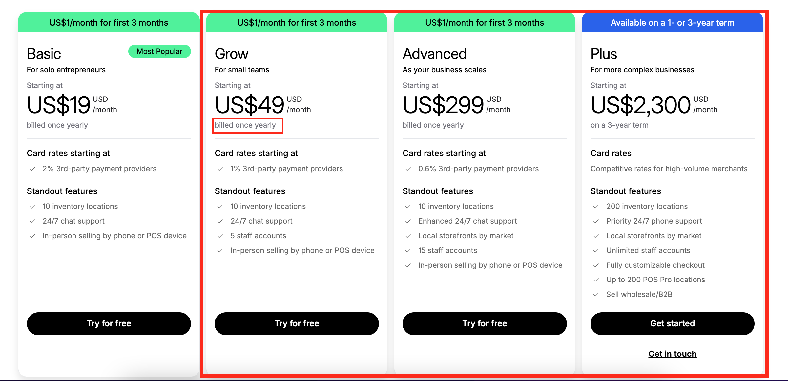
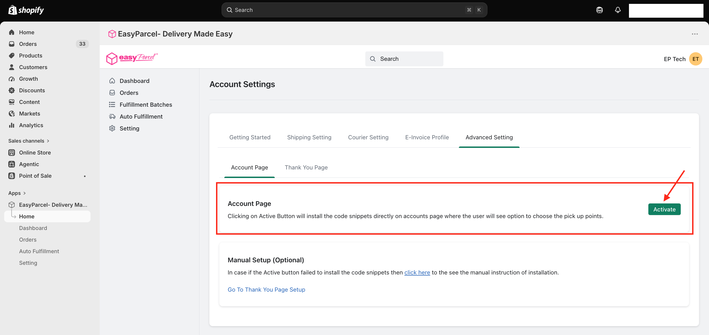
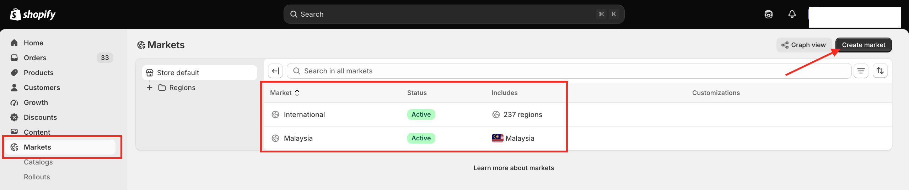
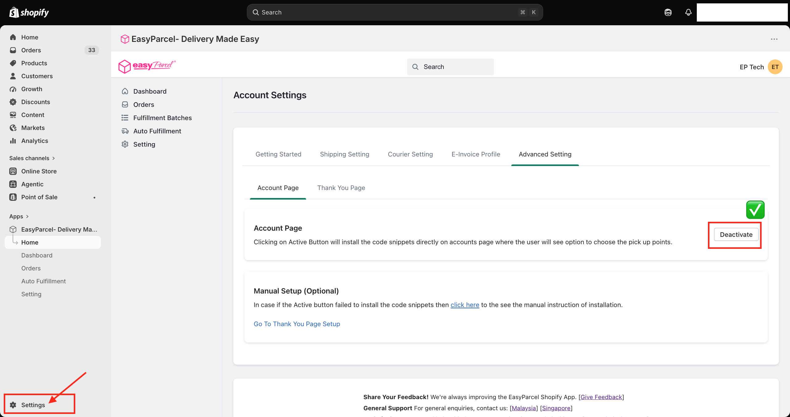
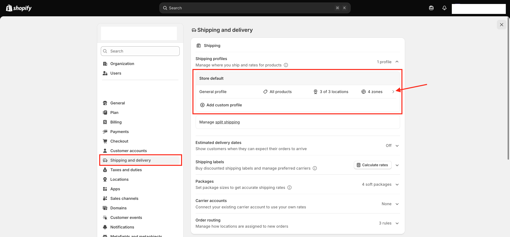
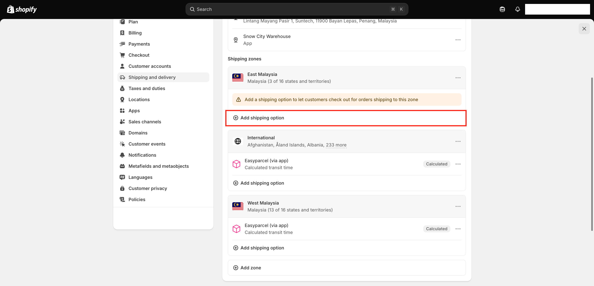
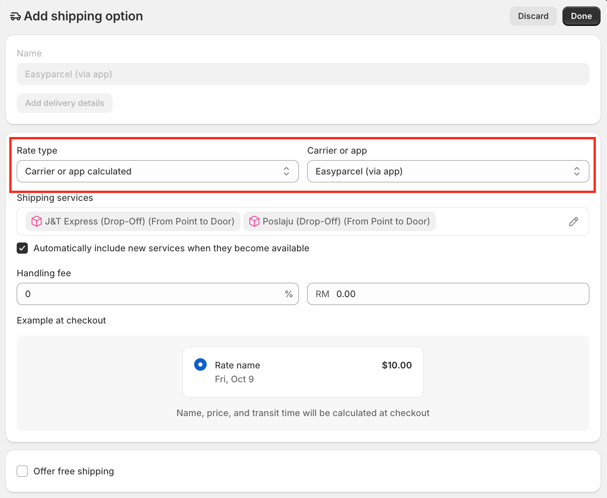

# ✨ Live Rates Guide: Real-Time Shipping at Checkout

> **TL;DR:** Check your Shopify plan → activate EasyParcel in the app → check your Markets → add EasyParcel as a shipping option in Shopify. Your customers now see live courier rates at checkout! 🛒

With **Live Rates**, your customers see **real-time courier rates** right at checkout and can pick the courier they like best. Upfront shipping costs, more choice, happier customers. 😊

⏱️ **Time needed:** About 10 minutes
📍 **Where:** EasyParcel app **and** your Shopify **Settings**

---

## 🗺️ Table of Contents

1. [Before You Start: Check Your Shopify Plan](#-before-you-start-check-your-shopify-plan)
2. [Step 1: Activate the Account Page in EasyParcel](#-step-1-activate-the-account-page-in-easyparcel)
3. [Step 2: Check Your Markets](#-step-2-check-your-markets)
4. [Step 3: Open Shipping and Delivery in Shopify](#-step-3-open-shipping-and-delivery-in-shopify)
5. [Step 4: Add EasyParcel as a Shipping Option](#-step-4-add-easyparcel-as-a-shipping-option)
6. [You're All Set!](#-youre-all-set)

---

## 🚨 Before You Start: Check Your Shopify Plan

> ⚠️ **Important: Shopify Carrier-Calculated Shipping Requirement**
>
> Shopify requires the **Carrier-Calculated Shipping** feature to display third-party live shipping rates during checkout.

| Your Shopify plan | Can you use Live Rates? |
|---|---|
| **Basic** | ❌ Not included |
| **Grow** (annual billing) | ✅ Yes |
| **Grow** (monthly billing) | ➕ Needs an extra step (see below) |
| **Advanced** | ✅ Yes, included |
| **Plus** | ✅ Yes, included |

**On Grow with monthly billing?** You can either:

- Add the **Carrier-Calculated Shipping** feature to your plan for an additional monthly fee, or
- Switch to **annual billing** to enable this feature.

> 💡 **Not sure which plan you're on?** In Shopify, go to **Settings** → **Plan**.

---

## 🔛 Step 1: Activate the Account Page in EasyParcel

1. Open the EasyParcel app and click **Setting**.
2. Click the **Advanced Setting** tab, then the **Account Page** tab.
3. Click **Activate**.

This installs the code your store needs so customers can **choose their pickup points**. 📍

Once it's done, the button changes to **Deactivate**. That means it's on! ✅

---

## 🌏 Step 2: Check Your Markets

Before setting up shipping, make sure Shopify is actually selling to the places you ship to.

1. In your Shopify admin, click **Markets**.
2. Check that the markets you ship to (e.g. **Malaysia**, **International**) are set to **Active**.
3. Missing one? Click **Create market** to add it.

---

## 🚚 Step 3: Open Shipping and Delivery in Shopify

Next, click **Settings** at the bottom left of your Shopify admin.

1. In **Settings**, click **Shipping and delivery**.
2. Under **Shipping profiles**, click **General profile**.

> 📦 **Have more than one shipping profile?** Products in a **custom profile** use that profile's shipping rates, not the General profile's. So repeat Steps 3 and 4 for **every profile** whose products should show live EasyParcel rates at checkout.

---

## ➕ Step 4: Add EasyParcel as a Shipping Option

Scroll down to **Shipping zones**. You'll need to add EasyParcel to **each zone** you ship to.

> 👀 **See a yellow warning saying "Add a shipping option…"?** That zone doesn't have a shipping option yet, so customers in that area **can't check out**. Let's fix that!

For each zone:

1. Click **Add shipping option**.
2. Set **Rate type** to **Carrier or app calculated**.
3. Set **Carrier or app** to **Easyparcel (via app)**.
4. Check the **Shipping services** listed. These are the couriers your customers can choose from.
5. Click **Done**.

| Extra option | What it does |
|---|---|
| ✅ **Automatically include new services when they become available** | New courier services are added for you, no need to come back and update |
| 💵 **Handling fee** | Add a little extra on top of the shipping rate, as a **%** or a fixed **RM** amount (e.g. to cover packaging) |
| 🎁 **Offer free shipping** | Give your customers free shipping |

> 🎯 **Pro tip:** Keep your Shopify zones in line with the zones in your [Courier Setting](Courier-Setting.md), like separate **West Malaysia** and **East Malaysia** zones. That way your customers always see the right rates. 💸

Once a zone is done, you'll see **Easyparcel (via app)** listed with a **Calculated** tag. Repeat for every zone! 🔁

> 🌏 **Shipping overseas too?** The steps are exactly the same for international shipments. Just make sure your **International** market is **Active** (Step 2), then add **Easyparcel (via app)** to your **International** shipping zone the same way. Your overseas customers will see live rates at checkout too! ✈️

---

## 🎉 You're All Set!

That's it! 🥳 Your customers will now see **live EasyParcel courier rates** at checkout and can pick the one they like best.

> 🛒 **Test it out:** Add a product to your cart and go to checkout. You should see your EasyParcel couriers and their rates!

> 🔗 **Bonus:** The courier your customer picks shows up in the **Delivery Method** column on your **Orders** page, and is selected for you automatically when you fulfil the order. ✨

---

  <b>Happy shipping! 📦✨</b> 
  <i>EasyParcel — Delivery Made Easy</i>

