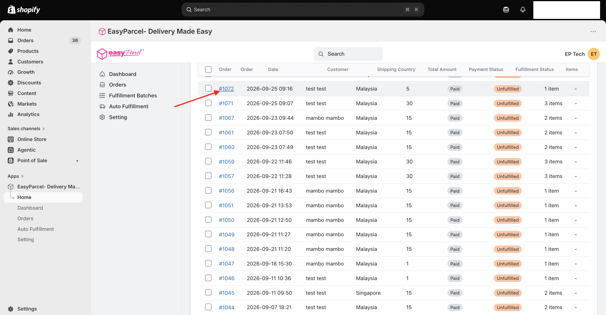
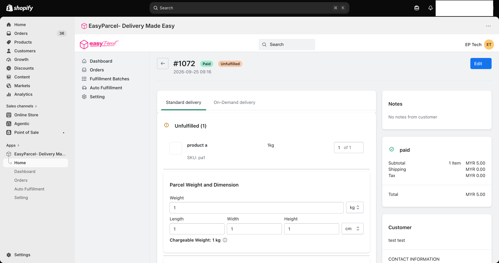
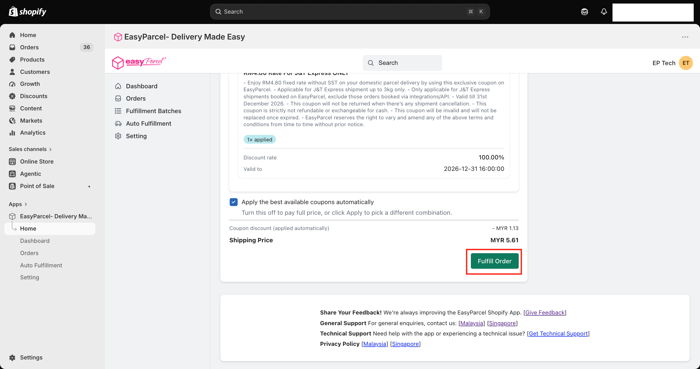
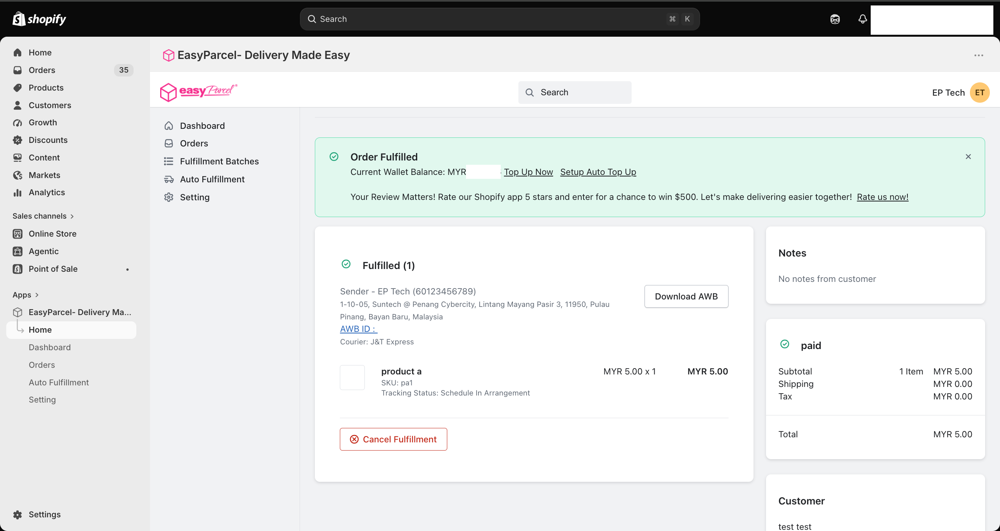

# 🧍 Single Fulfillment Guide: Ship One Order at a Time
 
> **TL;DR:** Click an order → review the details → **Fulfill Order**. Your AWB is generated and you're ready to ship. ✅
 
Single fulfilment is the best way to learn the ropes. 🎓 You see every detail, you stay in full control, and it only takes a few clicks. Do it a couple of times and it'll feel like second nature.
 
⏱️ **Time needed:** About 1 minute per order
📍 **Where:** EasyParcel app in Shopify → **Orders**
 
---
 
## ✅ Before You Start
 
Quick checklist so nothing trips you up:
 
- 🔌 Your store is **integrated** ([Integration Guide](Integration-Guide.md))
- 📍 Your **Sender Details** and **courier zones** are set up ([Settings Guide](Settings-Guide.md))
- 💳 The order is marked **Paid**
- 💰 You have enough **EasyParcel credit** in your wallet
---
 
## 👆 Step 1: Click Into the Order
 
Go to **Orders** and click the **order number** you want to ship (e.g. **#1072**).
 

 
> 💡 **Can't find it?** Type the order number into the **search bar**, or click the **Unfulfilled** tab to see only orders waiting to ship.
 
---
 
## 🔍 Step 2: Review Your Order
 
You'll land on the order details page. Scroll down and give everything a quick once-over, top to bottom. 👀
 

 
Here's what to look at:

> 🚚 **Standard or On-Demand?** Make sure you're on the **Standard delivery** tab for regular courier shipping. This guide covers Standard delivery.

### 📦 Unfulfilled Items

Check the products and the quantity you're shipping (e.g. **1 of 1**).

> 💡 **Only shipping part of the order?** Adjust the quantity to just what you're sending now. The order will show as **Partially fulfilled**, so you won't forget the rest.

### ⚖️ Parcel Weight and Dimension

Enter or confirm your parcel's **Weight** and its **Length**, **Width** and **Height**. You can switch units (kg, cm) using the dropdowns.

> ⚖️ **What's "Chargeable Weight"?** Couriers charge based on whichever is higher: the actual weight, or the size-based (volumetric) weight. So a big, light box may cost more than you'd expect. Accurate measurements = accurate rates! 📏

### 📝 Parcel Content

A short description of what's inside the parcel (e.g. "clothing"). It's filled in for you based on the order, but you can edit it.

> ✏️ Max **35 characters**, and **letters only** (no numbers or symbols).

### 💰 Parcel Value Declaration

The total value of the items in your parcel. The app works this out for you and pre-fills the **Declared Value**, so all you need to do is double-check it looks right. ✅

> ⚙️ **Want to change how this value is calculated?** In **Setting**, you can choose whether the declared value uses the **original item price** or the **discounted item price**. Whichever you pick is applied automatically to every order.

### 🏷️ HS Code & Parcel Category Selection

| Field | What to do |
|---|---|
| **Parcel Category** | Pick the category that best describes your items |
| **HS Code** | Search for and select the code that matches your product |

> 🌏 **Shipping overseas?** These are especially important for international shipments, as customs uses them to identify what's in your parcel.

### 🏠 Sender Address

This is where your parcel ships from. Your **default address** is selected automatically.

Shipping from somewhere else today? Click **Change Sender Address** to pick another saved location.

### 🚚 Courier and Drop Off

| Field | What to do |
|---|---|
| **Pickup Date** *(optional)* | Choose when you'd like the courier to collect your parcel |
| **Courier** | Pick your courier. The price is shown right next to it 💸 |
| **Drop Off** | Choose the drop-off point most convenient for you (for drop-off services) |

> 🔄 **Changed the weight or parcel details?** Click **Get Quote** to refresh the courier list and rates.

> 🙋 **Customer picked a courier at checkout?** It'll already be selected for you. You can see it next to **Shipping** in the order summary on the right.

### 🛡️ Add-On Services

Extra protection for your parcel, like coverage for loss or damage. Some are **free**, while others may come with **additional charges**, so check before you continue.

### 👉 On the Right Side

Don't forget to glance over the right side of the page:

| Section | What you'll find |
|---|---|
| **Notes** | Any special requests from your customer 📝 |
| **Payment summary** | Subtotal, shipping (and the courier chosen at checkout), tax and total |
| **Customer** | Name and contact information |
| **Shipping Address** | Where the parcel is going 📍 |
| **Billing Address** | The customer's billing details |
| **Tags** | Any tags added to the order in Shopify 🏷️ |

> 👀 **Quick check:** Make sure the shipping address and phone number look right. A 5-second check now saves a returned parcel later!

---
 
## 💸 Step 3: Scroll Down & Check the Price
 
Scroll down to see your **coupons** and the final **Shipping Price**.
 

 
> 🎟️ **Free savings!** With **Apply the best available coupons automatically** ticked ✅, the app picks the best coupons for you. Untick it to pay full price, or click **Apply** to choose a different combination.
 
---
 
## 🚀 Step 4: Click Fulfill Order
 
Everything looks good? Click **Fulfill Order**. 🎉
 
The shipping fee is deducted from your **EasyParcel credit**.
 
---
 
## 🎉 Step 5: Done! Grab Your AWB
 
That's it! 🥳 You'll see an **Order Fulfilled** message with your updated wallet balance.
 

 
Here's what you'll find:
 
| What | What it means |
|---|---|
| 🧾 **Download AWB** | Download and print your Air Waybill |
| 🔢 **AWB ID** | Your tracking number, synced back to Shopify automatically |
| 🚚 **Courier** | Who's delivering the parcel |
| 📍 **Tracking Status** | Where your parcel is at right now |
| 💰 **Current Wallet Balance** | Your credit left after this shipment |
 
Print the AWB, stick it on your parcel, and send it on its way! 📦➡️🚚
 
> 🖨️ **Printing tip:** Stick the AWB somewhere flat and visible on the parcel, and avoid covering the barcode with tape.
 
> 💰 **Running low on credit?** Click **Top Up Now**, or **Setup Auto Top Up** so you never run dry.
 
> ↩️ **Made a mistake?** Click **Cancel Fulfillment** on the order page.
 
---
 
## 🚀 Ready to Level Up?
 
Got the hang of it? Try these next:
 
| Next level | Why you'll love it |
|---|---|
| 👯 [Bulk Fulfillment](bulk-fulfillment.md) | Ship many orders in one go |
| 🤖 [Auto Fulfillment](auto-fulfillment.md) | Let orders ship themselves |
 
---

## 🙋 Need Help?

We're real humans, and we like helping. 💗

- 🇲🇾 **Malaysia:** [EasyParcel Malaysia Help Centre](https://app.easyparcel.com/my/en/contact-us)
- 🇸🇬 **Singapore:** [EasyParcel Singapore Help Centre](https://app.easyparcel.com/sg/en/contact-us)

---

  <b>Happy shipping! 📦✨</b> 
  <i>EasyParcel — Delivery Made Easy</i>

